<!-- FIG:mark --><!-- /FIG:mark -->

### Aurelius Huang · 阿浩

**Entropy reduction — of codebases, and of days.**

Agentic AI infrastructure at production scale, by day · [English](./README.md) · [简体中文](./docs/i18n/zh-CN/README.md) · [Notes](https://threefish-ai.github.io)

> 冬者岁之余，夜者日之余，阴雨者时之余。
>
> — Dong Yu (董遇), 3rd c.[^weilue] The surplus is already there; almost everyone lets it evaporate. [negentropy](https://github.com/ThreeFish-AI/negentropy) takes its name from Schrödinger's negative entropy.[^schrodinger]

---

<!-- FIG:growth --><!-- /FIG:growth -->

Eleven years, square-root scale. **<!-- DATA:cur_total -->9,311<!-- /DATA:cur_total --> in <!-- DATA:cur_year -->2026<!-- /DATA:cur_year -->** — after two years that are genuinely zero and one year that is genuinely down.

<!-- FIG:rhythm --><!-- /FIG:rhythm -->

The surplus, located: **<!-- DATA:peak_h -->22:00<!-- /DATA:peak_h -->**, <!-- DATA:peak_x -->2.54×<!-- /DATA:peak_x --> a flat baseline — <!-- DATA:commits_total -->4,349<!-- /DATA:commits_total --> open-source commits, Asia/Shanghai. Dawn is empty, not missing.

<!-- FIG:punchcard --><!-- /FIG:punchcard -->

The two-dimensional answer: densest cell **<!-- DATA:pc_cell -->Sun 22:00<!-- /DATA:pc_cell -->**, <!-- DATA:pc_val -->83<!-- /DATA:pc_val --> commits; <!-- DATA:pc_empty -->37<!-- /DATA:pc_empty --> of 168 cells are true zeros; weekends hold <!-- DATA:wknd_pct -->34.7%<!-- /DATA:wknd_pct --> against a 28.6% flat share.

<!-- FIG:surplus --><!-- /FIG:surplus -->

Weekday vs weekend, normalised to per-day rates (**<!-- DATA:wd_days -->572<!-- /DATA:wd_days --> weekdays ÷ <!-- DATA:we_days -->230<!-- /DATA:we_days --> weekend days**): same shape, and the weekend actually runs hotter per day — peak at <!-- DATA:we_peak_h -->22:00<!-- /DATA:we_peak_h -->. "By day" is a job description, not a schedule.

<!-- FIG:ground --><!-- /FIG:ground -->

[negentropy](https://github.com/ThreeFish-AI/negentropy) knowledge engine · [coding-proxy](https://github.com/ThreeFish-AI/coding-proxy) failover for coding agents · [hyper-git](https://github.com/ThreeFish-AI/hyper-git) changelists for VS Code · [agents.md](https://github.com/ThreeFish-AI/agents.md) the doctrine they are written under

<!-- FIG:accrual --><!-- /FIG:accrual -->

Cumulative, monthly: two curves flatten on the day they graduated into the trunk, which keeps climbing. Window <!-- DATA:win_from -->2024-06-22<!-- /DATA:win_from --> → <!-- DATA:win_to -->2026-09-01<!-- /DATA:win_to --> — **<!-- DATA:win_months -->26<!-- /DATA:win_months --> months, not the eleven years above.**

<!-- FIG:lifecycles --><!-- /FIG:lifecycles -->

Repositories as intervals, creation to last push; the two same-day endings are the graduation. Deleted repos are invisible at this caliber.

<!-- FIG:cadence --><!-- /FIG:cadence -->

Releases have timing, not just counts — latest: **<!-- DATA:rel_last_name -->give-me-a-break<!-- /DATA:rel_last_name --> <!-- DATA:rel_last_tag -->v0.1.6<!-- /DATA:rel_last_tag -->**. negentropy ships as merged PRs, not tags.

<!-- FIG:streak --><!-- /FIG:streak -->

The run, located: **<!-- DATA:streak -->88<!-- /DATA:streak --> days, <!-- DATA:streak_from -->2026-03-19<!-- /DATA:streak_from --> → <!-- DATA:streak_to -->2026-06-14<!-- /DATA:streak_to -->**, bracketed. The rug plots the latest 400 days; of the <!-- DATA:win_days -->802<!-- /DATA:win_days --> days in the whole window, <!-- DATA:active_days -->249<!-- /DATA:active_days --> carried a commit (<!-- DATA:active_pct -->31%<!-- /DATA:active_pct -->) — authored commits in source repos, a narrower population than the GitHub calendar above.

---

<!-- FIG:latency --><!-- /FIG:latency -->

What the median hides: p90 **<!-- DATA:p90 -->2.8 h<!-- /DATA:p90 -->**, longest **<!-- DATA:lat_max -->11.9 d<!-- /DATA:lat_max -->**; of <!-- DATA:pr_closed -->1118<!-- /DATA:pr_closed --> closed, <!-- DATA:pr_unmerged -->40<!-- /DATA:pr_unmerged --> were never merged and are excluded. Solo self-merge: this measures change-unit size, not review speed.

<!-- FIG:grammar --><!-- /FIG:grammar -->

Seventy-seven of a hundred, made countable: **<!-- DATA:top_type -->fix<!-- /DATA:top_type --> <!-- DATA:top_type_pct -->19.0%<!-- /DATA:top_type_pct -->** leads; **<!-- DATA:nonconf_n -->996<!-- /DATA:nonconf_n --> subjects (<!-- DATA:nonconf_pct -->22.9%<!-- /DATA:nonconf_pct -->) don't parse** — drawn as open cells, not hidden.

<!-- FIG:tongues --><!-- /FIG:tongues -->

Both conditions, not a silent pick: GitHub's endpoint says **<!-- DATA:lang_naive -->HTML<!-- /DATA:lang_naive --> <!-- DATA:lang_naive_pct -->67.8%<!-- /DATA:lang_naive_pct -->**; excluding the one generated-site repo, **<!-- DATA:lang_top -->Python<!-- /DATA:lang_top --> <!-- DATA:lang_top_pct -->69.1%<!-- /DATA:lang_top_pct -->**. Bytes measure source size, not effort or authorship.

<!-- FIG:upstream --><!-- /FIG:upstream -->

N = <!-- DATA:ext_prs -->6<!-- /DATA:ext_prs -->, named: <!-- DATA:ext_first -->2024-06-26<!-- /DATA:ext_first --> → <!-- DATA:ext_last -->2025-12-06<!-- /DATA:ext_last -->, <!-- DATA:ext_merged -->5<!-- /DATA:ext_merged --> merged, one closed unmerged — a fraction of a percent of all public PRs. The ratio is the point.

---

<!-- DATA:pub_prs -->1,849<!-- /DATA:pub_prs --> public pull requests ·
<!-- DATA:neg_pr -->1,078<!-- /DATA:neg_pr --> merged in negentropy, median <!-- DATA:neg_median -->6<!-- /DATA:neg_median --> min, <!-- DATA:pct_hour -->83%<!-- /DATA:pct_hour --> within an hour ·
<!-- DATA:streak -->88<!-- /DATA:streak -->-day streak ·
<!-- DATA:conv_pct -->77.1%<!-- /DATA:conv_pct --> Conventional Commits ·
<!-- DATA:rel_total -->29<!-- /DATA:rel_total --> releases ·
<!-- DATA:src_repos -->7<!-- /DATA:src_repos --> source repos,
<!-- DATA:own_stars -->51<!-- /DATA:own_stars --> stars actually mine ·
<!-- DATA:ext_merged -->5<!-- /DATA:ext_merged --> of <!-- DATA:ext_prs -->6<!-- /DATA:ext_prs --> upstream PRs merged — <!-- DATA:ext_dify -->4<!-- /DATA:ext_dify --> in the [Dify](https://github.com/langgenius/dify) ecosystem, one outside it

<b>Honesty notes</b>

- The headline count splits 5,590 public and clickable / 3,640 private work (as of 2026-09). Private work counts, but doesn't link — so it gets no headline.
- `negentropy` is a solo, self-merge repo: the PR is a titled, revertible unit of change, not a review gate. That is what the 6-minute median measures.
- [analysis_claude_code](https://github.com/ThreeFish-AI/analysis_claude_code) (<!-- DATA:acc_stars -->312<!-- /DATA:acc_stars --> stars) is mostly **not** my work — it mirrors [CrazyBoyM](https://github.com/CrazyBoyM) / ShareAI-Lab's Claude Code source analysis; the foundational commits are theirs. Mine in it: the reading notes.
- <!-- DATA:archived_names -->agentic-ai-cognizes, negentropy-perceives<!-- /DATA:archived_names --> (<!-- DATA:archived_n -->2<!-- /DATA:archived_n --> source repos, 1,378 commits between them) are archived — they graduated into the negentropy trunk, perceives as its extraction service and cognizes as `apps/cognizes`. Intended lifecycle, not failure. Frozen by definition: archives don't move.
- The sixth upstream PR was closed unmerged — same class of bug as the one above it, fixed upstream by a different route. Six against <!-- DATA:pub_prs -->1,849<!-- /DATA:pub_prs --> public PRs: almost all of my public work happens in repos where I am also the reviewer.
- The yearly figure uses a square-root scale so early years stay visible; it understates recent growth. All figures are regenerated monthly from the GitHub API by [one workflow](https://github.com/ThreeFish-AI/threefish-ai/blob/master/.github/workflows/refresh-profile-data.yml) — as of <!-- DATA:asof -->2026-09-05<!-- /DATA:asof -->.

---

[^weilue]: Yu Huan, *Weilüe* (魏略), “Biographies of Confucian Scholars”; survives via Pei Songzhi's annotation to Chen Shou, *Records of the Three Kingdoms* (三国志), *Biography of Wang Lang*, 3rd c. CE.

[^schrodinger]: E. Schrödinger, *What Is Life? The Physical Aspect of the Living Cell*. Cambridge, U.K.: Cambridge University Press, 1944.

[Notes](https://threefish-ai.github.io) · [CSDN](https://threefish.blog.csdn.net/) · [@ThreeFish-AI](https://github.com/ThreeFish-AI)

