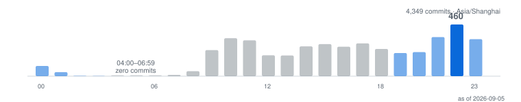

  

[English](./README.md) | [简体中文](./docs/i18n/zh-CN/README.md)

<h1 align="center">Aurelius Huang · 阿浩 🐟</h1>

<strong>Software drifts toward noise. Unclaimed time drifts toward waste. Same failure mode, two scales — I work on both.</strong>

Agentic AI infrastructure at production scale by day · entropy reduction as an engineering discipline, not a project name

  
  
  

> 冬者岁之余，夜者日之余，阴雨者时之余。
>
> *Winter is the year's surplus; night is the day's surplus; a rainy day is time's surplus.*
>
> — Dong Yu (董遇), 3rd century, on how a working man finds time to read.[^weilue] In Mandarin, "three surpluses" (三余, *sān yú*) is a near-homophone of "three fish" (三鱼) — hence the handle.

---

## What I'm Building

Four tools, each aimed at one mode of entropy:

**[negentropy](https://github.com/ThreeFish-AI/negentropy)** — a personal knowledge engine: six apps around one shared core, each wing built against a specific way information decays — overload, amnesia, superficiality, inaction, obscurity.
Evidence: <!-- DATA:neg_pr -->[1,078 merged pull requests](https://github.com/ThreeFish-AI/negentropy/pulls?q=is%3Apr+is%3Amerged)<!-- /DATA:neg_pr --> · <!-- DATA:neg_commits -->2,048<!-- /DATA:neg_commits --> commits · [CI workflows](https://github.com/ThreeFish-AI/negentropy/actions)

**[coding-proxy](https://github.com/ThreeFish-AI/coding-proxy)** — a multi-vendor proxy for coding agents. When a provider answers `429`, `403` or `503`, it fails over instead of failing.
Evidence: [12 releases](https://github.com/ThreeFish-AI/coding-proxy/releases) · latest `v0.5.2a8` · Python

**[hyper-git](https://github.com/ThreeFish-AI/hyper-git)** — IntelliJ's changelist model rebuilt for VS Code: multi-changelist staging, a hand-rendered commit graph, line-level commits.
Evidence: [7 releases](https://github.com/ThreeFish-AI/hyper-git/releases) · latest `v0.0.16` · 6 views · 102 commands · 403 unit tests

**[agents.md](https://github.com/ThreeFish-AI/agents.md)** — the doctrine the three above are written under: 道 mindset, 法 strategy, 术 tactics. Symlinked into the machines I work on, so editing it changes how my tools behave everywhere. Not a manifesto — a config file that happens to have opinions.

> **Note** — the map has changed shape once. [negentropy-perceives](https://github.com/ThreeFish-AI/negentropy-perceives) started as a standalone perception engine (158 merged PRs). It's archived now — because it graduated into the trunk and lives at [`apps/negentropy-perceives`](https://github.com/ThreeFish-AI/negentropy/tree/master/apps). That's the intended lifecycle, not a failure.

---

## Receipts

Every number below is something you can verify yourself, anonymously, in one click — or it comes with an explicit note about why you can't.

- **<!-- DATA:c2026 -->[9,306 contributions in 2026](https://github.com/ThreeFish-AI?tab=overview&from=2026-01-01&to=2026-12-31)<!-- /DATA:c2026 -->** — up from 129 in 2020, the year I came back. Of the API view's 9,230: **5,590 are public and clickable; 3,640 are private work that counts but doesn't link** (verified 2026-09). All eleven years plotted below, gaps included.
- **<!-- DATA:pub_prs -->[1,849 public pull requests](https://github.com/search?q=is%3Apr+author%3AThreeFish-AI+is%3Apublic&type=pullrequests)<!-- /DATA:pub_prs -->** — nearly all against my own repos, where every change goes through a pull request even when nobody else is watching. Median open-to-merge in `negentropy`: **<!-- DATA:neg_median -->6<!-- /DATA:neg_median --> minutes**, <!-- DATA:pct_hour -->83%<!-- /DATA:pct_hour --> merged within an hour. Solo repo, self-merge workflow — the PR is a titled, revertible unit of change, not a review gate.
- **<!-- DATA:rel_total -->[28 releases](https://github.com/ThreeFish-AI?tab=repositories&type=source)<!-- /DATA:rel_total --> across <!-- DATA:rel_repos -->4<!-- /DATA:rel_repos --> repos** — coding-proxy <!-- DATA:rel_cp -->12<!-- /DATA:rel_cp -->, give-me-a-break <!-- DATA:rel_gmab -->7<!-- /DATA:rel_gmab -->, hyper-git <!-- DATA:rel_hg -->7<!-- /DATA:rel_hg -->, negentropy <!-- DATA:rel_neg -->2<!-- /DATA:rel_neg -->. Shipping, not just committing.
- **<!-- DATA:src_repos -->7<!-- /DATA:src_repos --> source repositories, <!-- DATA:own_stars -->51<!-- /DATA:own_stars --> stars that are actually mine.** Not the aggregate my profile shows — see the note at the bottom.
- **Six upstream pull requests, five merged** — [Notion row-order extraction](https://github.com/langgenius/dify/pull/22646), [Postgres full-text escaping](https://github.com/langgenius/dify/pull/8921), [Notion sync truncation](https://github.com/langgenius/dify/pull/5631), and [a GCS double-write fix](https://github.com/langgenius/dify-cloud-kit/pull/3) in the [Dify](https://github.com/langgenius/dify) ecosystem, plus [a missing OTLP dependency](https://github.com/DayuanJiang/next-ai-draw-io/pull/124); [the sixth](https://github.com/langgenius/dify-plugin-daemon/pull/389) is still open.

> **What I'm not counting.** My GitHub also shows ~2,500 pull requests and 641 code reviews in private repositories (as of 2026-09). Those are real, but you can't open them, so they don't get a headline. Small numbers you can click beat big numbers you can't.

  

Every year plotted, equal spacing, square-root scale so the early years stay visible. Yes, 2023 is lower than 2022 — <a href="https://github.com/ThreeFish-AI?tab=overview&from=2023-01-01&to=2023-12-31">check it</a>. Refreshed monthly by <a href="https://github.com/ThreeFish-AI/threefish-ai/blob/master/.github/workflows/refresh-profile-data.yml">one workflow</a>.

---

## Why "ThreeFish"

Dong Yu's answer was not "make time" — it was: the surplus is already there, and almost everyone lets it evaporate. I run the same instinct one layer up, as an engineering discipline: **entropy reduction (熵减)**. Information systems left alone drift toward noise exactly the way unclaimed time drifts toward waste. [negentropy](https://github.com/ThreeFish-AI/negentropy) takes its name straight from Schrödinger's negative entropy[^schrodinger] — order is not a state you arrive at; it's something you keep importing.

Here is what the study habit actually looks like in my commit timestamps:

  

<b><!-- DATA:peak_h -->22:00<!-- /DATA:peak_h --> is the busiest hour of the day — <!-- DATA:peak_n -->460<!-- /DATA:peak_n --> commits, <!-- DATA:peak_x -->2.54×<!-- /DATA:peak_x --> a flat baseline. And the dead zone before dawn is real, not missing data.</b> Open-source commits only, <!-- DATA:src_repos -->7<!-- /DATA:src_repos --> source repositories, Asia/Shanghai · weekends <!-- DATA:weekend_pct -->34.7%<!-- /DATA:weekend_pct --> — night as surplus, not night as debt.

**How the work is run** — single-author repos, governed like a team's:

- Every change is a pull request, even solo. <!-- DATA:conv_pct -->77.1%<!-- /DATA:conv_pct --> of <!-- DATA:commits_total -->4,349<!-- /DATA:commits_total --> commits follow Conventional Commits, <!-- DATA:scoped_pct -->98.4%<!-- /DATA:scoped_pct --> of those with a scope. Type mix: `fix` <!-- DATA:mix_fix -->24.7%<!-- /DATA:mix_fix --> · **`docs` <!-- DATA:mix_docs -->21.6%<!-- /DATA:mix_docs -->** · `feat` <!-- DATA:mix_feat -->20.8%<!-- /DATA:mix_feat --> — documentation commits nearly equal feature commits; that ratio is the philosophy in one number.
- Longest unbroken public-commit run: **<!-- DATA:streak -->88<!-- /DATA:streak --> days**; <!-- DATA:active_days -->338<!-- /DATA:active_days --> of the last 365 days active.

Recompute any of this: <code>for r in $(gh api users/ThreeFish-AI/repos --paginate --jq '.[]|select(.fork==false)|.name'); do gh api "/repos/ThreeFish-AI/$r/commits?author=ThreeFish-AI" --paginate --jq '.[].commit.message|split("\n")[0]'; done</code>

---

<b>About the most-starred repository on my profile</b>

 

[analysis_claude_code](https://github.com/ThreeFish-AI/analysis_claude_code) carries <!-- DATA:acc_stars -->312<!-- /DATA:acc_stars --> stars and 112 forks. **The reverse-engineering corpus is not my work.** It mirrors [CrazyBoyM](https://github.com/CrazyBoyM) / ShareAI-Lab's analysis of Claude Code's obfuscated source — every foundational commit (June–July 2025, before this repo even existed under my account) is theirs, and their credit line is in that README. GitHub shows no fork banner because the repo wasn't created via fork — so I'm saying it here instead.

What's mine in it: the reading — a Claude Code SDK research notebook and a workflow analysis of how it decomposes complex tasks. If you came for Claude Code internals, that's what to look at. If you came for what gets built with such things, see [coding-proxy](https://github.com/ThreeFish-AI/coding-proxy) and [negentropy](https://github.com/ThreeFish-AI/negentropy).

So: **<!-- DATA:src_repos -->7<!-- /DATA:src_repos --> source repositories, <!-- DATA:own_stars -->51<!-- /DATA:own_stars --> stars, ~1,850 public PRs, 28 releases.** Those are the numbers I'd rather be judged on.

---

## Elsewhere

[Notes](https://threefish-ai.github.io) · [CSDN](https://threefish.blog.csdn.net/) · [@ThreeFish-AI](https://github.com/ThreeFish-AI)

<!-- Bilibili / Zhihu: confirm handles resolve before enabling — a dead link on a page about verifiable claims is worse than no link. -->

---

[^weilue]: Yu Huan, *Weilüe* (魏略), "Biographies of Confucian Scholars" (儒宗传); the text is lost and survives via Pei Songzhi's annotation to Chen Shou, *Records of the Three Kingdoms* (三国志), *Biography of Wang Lang* (王朗传, appended biography of Wang Su), 3rd century CE.

[^schrodinger]: E. Schrödinger, *What is Life? The Physical Aspect of the Living Cell*. Cambridge, U.K.: Cambridge University Press, 1944.

  Figures above the fold are refreshed monthly from the GitHub API by <a href="https://github.com/ThreeFish-AI/threefish-ai/blob/master/.github/workflows/refresh-profile-data.yml">one workflow</a>; hand-quoted numbers carry their own as-of dates · <!-- DATA:asof -->last refreshed 2026-09-05<!-- /DATA:asof --> 
  Built with 🧠, ❤️, and an absurd amount of coffee by <a href="https://github.com/ThreeFish-AI">ThreeFish-AI</a>.

