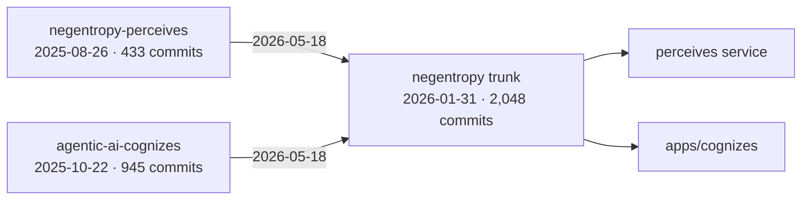
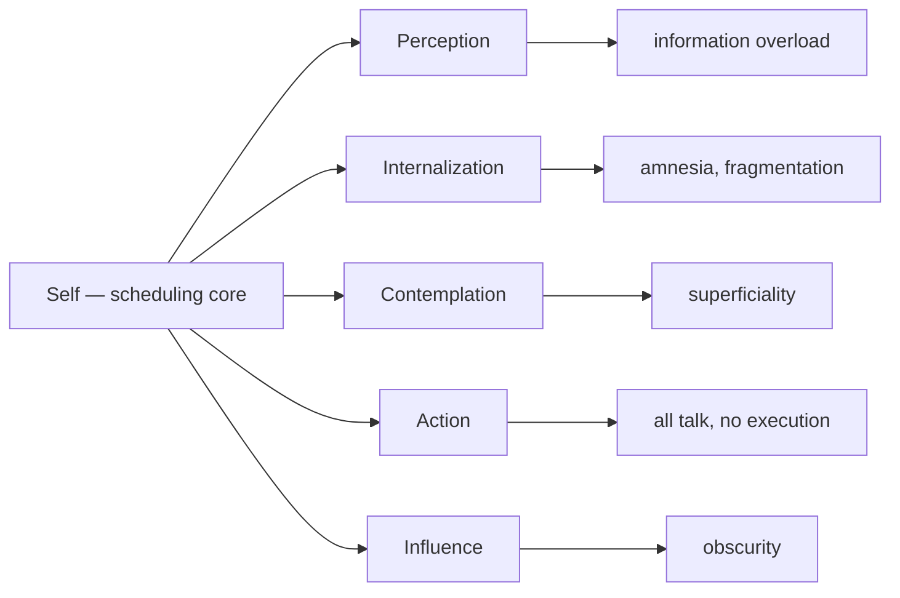
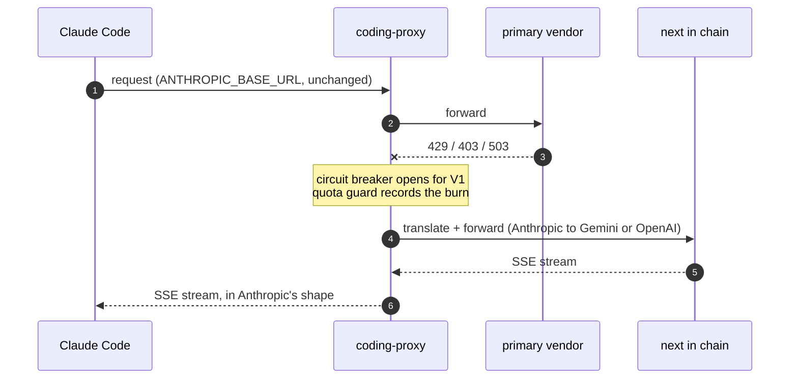

###  Aurelius Huang · 三余

**Entropy reduction — of codebases, and of days.**

Agentic AI infrastructure at production scale, by day · [English](./README.md) · [简体中文](./docs/i18n/zh-CN/README.md) · [Notes](https://threefish-ai.github.io)

**Now** — negentropy toward a 1.0 that has not been promised · hyper-git M5, five AI seams that still return null · coding-proxy translation fidelity across three request shapes · as of <!-- DATA:asof -->2026-09-05<!-- /DATA:asof -->

> 冬者岁之余，夜者日之余，阴雨者时之余。
>
> — Dong Yu (董遇), 3rd c.[^weilue] Winter is the year's surplus; night is the day's; rain is time's. His answer was not *make time* — it was: the surplus is already there, and almost everyone lets it evaporate.

> Order is not a state you arrive at. It is something a living system keeps importing — negative entropy, drawn from its surroundings, continuously, or it stops being alive.[^schrodinger] Two scales, one failure mode: codebases drift toward noise the way unclaimed hours drift toward waste. [negentropy](https://github.com/ThreeFish-AI/negentropy) is named after the second sentence and built for the first.

**How to read this page.** Every number is collected at the caliber a logged-out visitor can reproduce — the public contributions page, `is:public` search, public REST endpoints. A token is used for rate limit, never to widen the view. Anything I can see and you cannot is hand-written and dated. Figures refresh monthly; if any check fails, the job writes nothing at all.

---

<!-- FIG:growth --><!-- /FIG:growth -->

Eleven years, square-root scale. **<!-- DATA:cur_total -->9,313<!-- /DATA:cur_total --> in <!-- DATA:cur_year -->2026<!-- /DATA:cur_year -->** — after two years that are genuinely zero and one year that is genuinely down.

**2016** — one commit. **2017–2018** — nothing; the gap in the chart is real, and it is two years long. **2019** — 13. **2020** — 129, the year of coming back. **2022** — 676. **2023** — 589, lower than the year before, and the chart does not smooth it. **2024** — 1,181; the first upstream patch merged into [Dify](https://github.com/langgenius/dify/pull/5631) that July. **2025** — 3,193; `negentropy-perceives` in August, `agentic-ai-cognizes` in October. **2026-01-31** — the trunk starts. **2026-05-18** — both of those repositories are archived into it. **<!-- DATA:cur_year -->2026<!-- /DATA:cur_year -->** — <!-- DATA:cur_total -->9,313<!-- /DATA:cur_total --> so far.

<!-- FIG:rhythm --><!-- /FIG:rhythm -->

The surplus, located: **<!-- DATA:peak_h -->22:00<!-- /DATA:peak_h -->**, <!-- DATA:peak_x -->2.54×<!-- /DATA:peak_x --> a flat baseline — <!-- DATA:commits_total -->4,349<!-- /DATA:commits_total --> open-source commits, Asia/Shanghai. Dawn is empty, not missing.

<!-- FIG:punchcard --><!-- /FIG:punchcard -->

The two-dimensional answer: densest cell **<!-- DATA:pc_cell -->Sun 22:00<!-- /DATA:pc_cell -->**, <!-- DATA:pc_val -->83<!-- /DATA:pc_val --> commits; <!-- DATA:pc_empty -->37<!-- /DATA:pc_empty --> of 168 cells are true zeros; weekends hold <!-- DATA:wknd_pct -->34.7%<!-- /DATA:wknd_pct --> against a 28.6% flat share.

<!-- FIG:surplus --><!-- /FIG:surplus -->

Weekday vs weekend, normalised to per-day rates (**<!-- DATA:wd_days -->572<!-- /DATA:wd_days --> weekdays ÷ <!-- DATA:we_days -->230<!-- /DATA:we_days --> weekend days**): same shape, and the weekend actually runs hotter per day — peak at <!-- DATA:we_peak_h -->22:00<!-- /DATA:we_peak_h -->. "By day" is a job description, not a schedule.

<!-- FIG:ground --><!-- /FIG:ground -->

[negentropy](https://github.com/ThreeFish-AI/negentropy) knowledge engine · [coding-proxy](https://github.com/ThreeFish-AI/coding-proxy) failover for coding agents · [hyper-git](https://github.com/ThreeFish-AI/hyper-git) changelists for VS Code · [agents.md](https://github.com/ThreeFish-AI/agents.md) the doctrine they are written under

<!-- FIG:accrual --><!-- /FIG:accrual -->

Cumulative, monthly: two curves flatten on the day they graduated into the trunk, which keeps climbing. Window <!-- DATA:win_from -->2024-06-22<!-- /DATA:win_from --> → <!-- DATA:win_to -->2026-09-01<!-- /DATA:win_to --> — **<!-- DATA:win_months -->26<!-- /DATA:win_months --> months, not the eleven years above.**

<!-- FIG:lifecycles --><!-- /FIG:lifecycles -->

Repositories as intervals, creation to last push; the two same-day endings are the graduation. Deleted repos are invisible at this caliber.

<!-- FIG:cadence --><!-- /FIG:cadence -->

Releases have timing, not just counts — latest: **<!-- DATA:rel_last_name -->give-me-a-break<!-- /DATA:rel_last_name --> <!-- DATA:rel_last_tag -->v0.1.6<!-- /DATA:rel_last_tag -->**. negentropy ships as merged PRs, not tags.

<!-- FIG:streak --><!-- /FIG:streak -->

The run the rug brackets: **<!-- DATA:rug_streak -->88<!-- /DATA:rug_streak --> days, <!-- DATA:rug_streak_from -->2026-03-19<!-- /DATA:rug_streak_from --> → <!-- DATA:rug_streak_to -->2026-06-14<!-- /DATA:rug_streak_to -->**, the longest inside its latest-400-day window; the all-time longest is <!-- DATA:streak -->88<!-- /DATA:streak --> days (<!-- DATA:streak_from -->2026-03-19<!-- /DATA:streak_from --> → <!-- DATA:streak_to -->2026-06-14<!-- /DATA:streak_to -->). Of the <!-- DATA:win_days -->802<!-- /DATA:win_days --> days in the whole window, <!-- DATA:active_days -->249<!-- /DATA:active_days --> carried a commit (<!-- DATA:active_pct -->31%<!-- /DATA:active_pct -->) — authored commits in source repos, a narrower population than the GitHub calendar above.

---

<!-- FIG:latency --><!-- /FIG:latency -->

What the median hides: p90 **<!-- DATA:p90 -->2.8 h<!-- /DATA:p90 -->**, longest **<!-- DATA:lat_max -->11.9 d<!-- /DATA:lat_max -->**; of <!-- DATA:pr_closed -->1118<!-- /DATA:pr_closed --> closed, <!-- DATA:pr_unmerged -->40<!-- /DATA:pr_unmerged --> were never merged and are excluded. Solo self-merge: this measures change-unit size, not review speed.

<!-- FIG:grammar --><!-- /FIG:grammar -->

Seventy-seven of a hundred, made countable: **<!-- DATA:top_type -->fix<!-- /DATA:top_type --> <!-- DATA:top_type_pct -->19.0%<!-- /DATA:top_type_pct -->** leads; **<!-- DATA:nonconf_n -->996<!-- /DATA:nonconf_n --> subjects (<!-- DATA:nonconf_pct -->22.9%<!-- /DATA:nonconf_pct -->) don't parse** — drawn as open cells, not hidden.

<!-- FIG:tongues --><!-- /FIG:tongues -->

Both conditions, not a silent pick: GitHub's endpoint says **<!-- DATA:lang_naive -->HTML<!-- /DATA:lang_naive --> <!-- DATA:lang_naive_pct -->67.8%<!-- /DATA:lang_naive_pct -->**; excluding the one generated-site repo, **<!-- DATA:lang_top -->Python<!-- /DATA:lang_top --> <!-- DATA:lang_top_pct -->69.1%<!-- /DATA:lang_top_pct -->**. Bytes measure source size, not effort or authorship.

<!-- FIG:upstream --><!-- /FIG:upstream -->

N = <!-- DATA:ext_prs -->6<!-- /DATA:ext_prs -->, named: <!-- DATA:ext_first -->2024-06-26<!-- /DATA:ext_first --> → <!-- DATA:ext_last -->2025-12-06<!-- /DATA:ext_last -->, <!-- DATA:ext_merged -->5<!-- /DATA:ext_merged --> merged, one closed unmerged — a fraction of a percent of all public PRs. The ratio is the point.

---

### Built against five ways things fall apart

**[negentropy](https://github.com/ThreeFish-AI/negentropy)** — a personal knowledge engine: one scheduling core, five wings, each aimed at one form of decay. Perception against information overload. Internalization against amnesia. Contemplation against superficiality. Action against all-talk. Influence against obscurity. Memory fades on an Ebbinghaus curve, because remembering everything is its own kind of noise. The whole stack comes up with one command, five containers, and zero cloud credentials.
Python 3.13 · Next.js 16 · Google ADK · Apache-2.0 · <!-- DATA:neg_commits -->2,048<!-- /DATA:neg_commits --> commits · <!-- DATA:neg_pr -->1,078<!-- /DATA:neg_pr --> merged PRs · two release candidates and no 1.0

**[coding-proxy](https://github.com/ThreeFish-AI/coding-proxy)** — N-tier failover for coding agents. When the primary vendor answers `429`, `403` or `503`, the request descends the chain instead of failing: Claude plans, Copilot, Antigravity, GLM, MiniMax, Qwen, Kimi, Doubao. Per-vendor circuit breaker and quota guard; bidirectional Anthropic↔Gemini and Anthropic↔OpenAI translation, streaming included. The client changes one line — `ANTHROPIC_BASE_URL` — and never learns any of this happened.
Python · FastAPI · httpx · SQLite-WAL token dashboard, no Redis, no queue · <!-- DATA:rel_cp -->12<!-- /DATA:rel_cp --> releases, latest still alpha-tagged

**[hyper-git](https://github.com/ThreeFish-AI/hyper-git)** — IntelliJ's commit model, rebuilt inside VS Code: multi-changelist grouping, a hand-rendered commit-graph DAG with swimlanes and seven composable filters, line-level and hunk-level commits, a shelf that owes nothing to `git stash`, a hand-built three-way merge editor. `engine/` is pure logic with zero `vscode` imports — which is the only reason 403 unit tests can exist.
TypeScript · 6 views · 102 commands · 403 unit tests · <!-- DATA:rel_hg -->7<!-- /DATA:rel_hg --> releases · MIT · milestones M0–M4 shipped, M5 not started · on the [VS Code Marketplace](https://marketplace.visualstudio.com/items?itemName=ThreeFish-AI.hyper-git-agentic-git)

**[give-me-a-break](https://github.com/ThreeFish-AI/give-me-a-break)** — a menu-bar app that masks every display when it is time to stop. Pink noise synthesized live, no audio files shipped. Escape is possible and costs two deliberate keystrokes; a forced rest with no escape valve is a rest people uninstall. A meeting counts as work and *defers* the break rather than eating it.
Swift · macOS 14+ · a C# Windows build · <!-- DATA:rel_gmab -->7<!-- /DATA:rel_gmab --> releases · unsigned and un-notarized, with the `xattr -dr` line printed in the README rather than hidden

**[agents.md](https://github.com/ThreeFish-AI/agents.md)** — the doctrine the four above are written under, symlinked into every agent on the machine by `./sync.sh --link`. Not a manifesto; a config file that happens to have opinions.

**Written in** Python 3.13 · TypeScript · Swift · Shell, with a C# side build. **Run on** FastAPI · httpx · Next.js 16 · Google ADK · PostgreSQL · SQLite-WAL · MCP · MicroSandbox. **Kept honest by** structlog · OpenTelemetry · Langfuse. **Built with** `uv` · `pnpm` · one command and five containers. **No** Redis, no message queue, no cloud credentials on the default path.

---

<b>Volume</b> · <!-- DATA:commits_total -->4,349<!-- /DATA:commits_total --> commits across <!-- DATA:src_repos -->7<!-- /DATA:src_repos --> source repositories · <!-- DATA:pub_prs -->1,849<!-- /DATA:pub_prs --> public pull requests · <!-- DATA:rel_total -->29<!-- /DATA:rel_total --> releases · <!-- DATA:own_stars -->51<!-- /DATA:own_stars --> stars actually mine 
<b>Cadence</b> · peak hour <!-- DATA:peak_h -->22:00<!-- /DATA:peak_h --> at <!-- DATA:peak_x -->2.54×<!-- /DATA:peak_x --> a flat baseline · <!-- DATA:wknd_pct -->34.7%<!-- /DATA:wknd_pct --> on weekends · <!-- DATA:streak -->88<!-- /DATA:streak -->-day longest run · of <!-- DATA:win_days -->802<!-- /DATA:win_days --> days, <!-- DATA:active_days -->249<!-- /DATA:active_days --> active 
<b>Discipline</b> · <!-- DATA:conv_pct -->77.1%<!-- /DATA:conv_pct --> Conventional Commits · median <!-- DATA:neg_median -->6<!-- /DATA:neg_median --> min open-to-merge, <!-- DATA:pct_hour -->83%<!-- /DATA:pct_hour --> within an hour, self-merged · <!-- DATA:ext_merged -->5<!-- /DATA:ext_merged --> of <!-- DATA:ext_prs -->6<!-- /DATA:ext_prs --> upstream PRs merged

**Upstream, in code I do not own** — <!-- DATA:ext_merged -->5<!-- /DATA:ext_merged --> of <!-- DATA:ext_prs -->6<!-- /DATA:ext_prs --> pull requests merged, <!-- DATA:ext_dify -->4<!-- /DATA:ext_dify --> of them in the [Dify](https://github.com/langgenius/dify) ecosystem.

| Merged | Repository | Change |
|---|---|---|
| 2024-06-26 | langgenius/dify | [document truncation and loss in Notion sync](https://github.com/langgenius/dify/pull/5631) |
| 2024-09-30 | langgenius/dify | [special characters in Postgres full-text search](https://github.com/langgenius/dify/pull/8921) |
| 2025-07-08 | langgenius/dify-cloud-kit | [overwrite when GCS save is called twice](https://github.com/langgenius/dify-cloud-kit/pull/3) |
| 2025-07-18 | langgenius/dify | [Notion database rows in row order, with row URLs](https://github.com/langgenius/dify/pull/22646) |
| 2025-12-06 | DayuanJiang/next-ai-draw-io | [missing OTLP trace exporter dependency](https://github.com/DayuanJiang/next-ai-draw-io/pull/124) |
| *closed unmerged* | langgenius/dify-plugin-daemon | [check `Exists` before `Save` in OSS](https://github.com/langgenius/dify-plugin-daemon/pull/389) |

Six against <!-- DATA:pub_prs -->1,849<!-- /DATA:pub_prs --> public PRs is the honest ratio: almost all of my public work is in repositories where I am also the reviewer.

### One input box, three papers

`give-me-a-break` shows a small box before each natural break and asks: what did you just finish, and optionally, what is next. It looks like a punch clock. It is the opposite of one.

Leroy's work on attention residue is the reason it exists at all: when you switch tasks, part of your attention stays on the previous one, and the effect is worst when the task was interrupted or left unfinished.[^leroy] A break is an interruption by definition. So the box is not there to measure the session — it is there to close it: sixty seconds to write down *done, remaining, first step on return*, which is a ready-to-resume plan and, more importantly, permission to stop thinking about it.

Stubblebine's interstitial journaling supplies the trigger and the dose: fire on the task transition rather than on the clock, two to four sentences, sixty to ninety seconds, and stay light — anything heavier is abandoned in the first week.[^interstitial] Fogg supplies the design constraint: at the moment a prompt fires, motivation is low and variable, so the only lever left is ability.[^fogg] Hence every field optional, Enter submits, the box auto-releases on timeout, and there is no minimum length — a minimum length is a proven completion killer.

It is pinned to exactly one boundary, `working → resting`, and it never blocks the break. A rest ritual that can prevent rest is not a rest ritual.

An exercise log appears symmetrically at the end of the break; both roll up into native week, month, quarter and year reports. Whether any of this changes behaviour over months, I have not measured — n=1, no baseline, and the literature above is about attention and habit formation in general, not about this app. It is a reasoned design, not a validated one.

<b>Honesty notes</b>

- `negentropy` is a solo, self-merge repo: the PR is a titled, revertible unit of change, not a review gate. That is what the <!-- DATA:neg_median -->6<!-- /DATA:neg_median -->-minute median measures.
- [analysis_claude_code](https://github.com/ThreeFish-AI/analysis_claude_code) (<!-- DATA:acc_stars -->312<!-- /DATA:acc_stars --> stars) is mostly **not** my work — it mirrors [CrazyBoyM](https://github.com/CrazyBoyM) / ShareAI-Lab's Claude Code source analysis; the foundational commits are theirs. Mine in it: the reading notes.
- <!-- DATA:archived_names -->agentic-ai-cognizes, negentropy-perceives<!-- /DATA:archived_names --> (<!-- DATA:archived_n -->2<!-- /DATA:archived_n --> source repos, 1,378 commits between them) are archived — they graduated into the negentropy trunk, perceives as its extraction service and cognizes as `apps/cognizes`. Intended lifecycle, not failure. Frozen by definition: archives don't move.
- The "Now" line under the tagline is the one thing on this page the automation cannot verify; it is hand-maintained and rots faster than everything else.
- The yearly figure uses a square-root scale so early years stay visible; it understates recent growth. All figures are regenerated monthly from the GitHub API by [one workflow](https://github.com/ThreeFish-AI/threefish-ai/blob/master/.github/workflows/refresh-profile-data.yml) — as of <!-- DATA:asof -->2026-09-05<!-- /DATA:asof -->.

<b>Two repositories were archived on the same day. On purpose.</b>

`negentropy-perceives` was a standalone perception engine — web pages and PDFs into clean Markdown for language models. `agentic-ai-cognizes` was a paper platform for Chinese readers: 27 papers collected, 16 translated, 82% backend test coverage, 7 Claude Skills at the time it closed. Both worked. Both were archived on **2026-05-18**, three and a half months after the trunk existed, because two working systems that share a memory layer and do not share a process are two systems you keep re-integrating by hand.

That is the intended lifecycle: a repository is a hypothesis, and the good outcome is that it stops needing to be separate.

1,378 commits sit in those two archives. They are counted in the totals on this page and they are not reachable as active work — if you want to judge only what is live, subtract them.

<b>negentropy — one root, five wings</b>

Each wing exists because of the column on its right. Perception turns pages and PDFs into clean Markdown; internalization is a knowledge graph plus semantic search with Ebbinghaus decay, so recall costs something and forgetting is designed rather than accidental; contemplation is where a claim gets argued with; action is MCP plus a MicroSandbox dual channel, so generated code runs somewhere it can fail safely; influence is the part that publishes.

Backends are pluggable — in-memory, PostgreSQL, VertexAI, GCS — and the default path needs no cloud credentials at all: `./dev` brings up five containers. Observability is structlog, OpenTelemetry and Langfuse, which is the honest admission that a five-wing system is not debuggable by reading it.

Two release candidates, no 1.0. The five wings are not equally finished — perception and internalization carry the two archived repositories' worth of history; influence is the thinnest.

<b>coding-proxy — what a 429 looks like from the client's side</b>

The client is told nothing. That is the whole product: one line of configuration, and the failure mode changes from *stop working* to *work slower on someone else's model*. Nine vendors are wired — Claude plans, GitHub Copilot, Google Antigravity, Z AI's GLM, MiniMax, Qwen, Xiaomi, Kimi, Doubao — with a per-vendor circuit breaker and quota guard, and a local SQLite-WAL dashboard so the burn is visible before the bill is.

FastAPI and httpx; no Redis, no message queue. <!-- DATA:rel_cp -->12<!-- /DATA:rel_cp --> releases, the latest still alpha-tagged — translation fidelity across three request shapes is the part that keeps not being finished. Chained failover also means a request can succeed on a model you did not choose; the dashboard exists partly so that is auditable.

<b>The same move, four times: make the core a pure function</b>

- **`give-me-a-break`** — the state machine's `evaluate` has zero time dependency. It takes the clock as an argument, so the entire rest/work/AFK lifecycle is testable against a virtual clock: sleep, crash recovery with fast-forward, a display unplugged mid-break. Three modules, one of which knows nothing about macOS.
- **`hyper-git`** — `engine/` contains no `vscode` import. That single constraint is why 403 unit tests exist: changelist grouping, DAG swimlane layout, and Conventional Commits validation are all testable without an editor host. The architecture note calls it "Path B" — consume the stable `vscode.git` API and hand-render everything above it, rather than fork.
- **`hyper-git`, again** — five AI seams (`ILlmProvider`, `ICommitMessageProvider`, `IPreCommitInspector`, `IChangelistGrouper`, `IConflictResolver`) are wired in as null implementations, modeled on JetBrains' `CheckinHandler` lifecycle. The interfaces ship; the intelligence is deferred to M5. Declaring the seam early is cheap and declaring it late is not.
- **`coding-proxy`** — the failover chain is policy, not plumbing: circuit breaker state and quota accounting are per-vendor and local, in SQLite-WAL. No Redis, no queue, so a single process is the whole deployment and a restart loses nothing that matters.
- **`negentropy`** — backends are pluggable across in-memory, PostgreSQL, VertexAI and GCS, and the default path boots with **no cloud credentials at all**. If the cheapest configuration is not runnable, nobody runs the expensive one either.

Stated as a virtue, this is testability. Stated honestly, it is what a single maintainer has to do to survive his own codebase: nothing here has a second pair of eyes, so the design has to make the mistakes cheap to find. And the null AI seams are still null — the interfaces are a plan, not a feature.

<b>The doctrine these repositories are written under — 道 / 法 / 术</b>

[agents.md](https://github.com/ThreeFish-AI/agents.md) is three tiers, deliberately: mindset, strategy, tactics. `./sync.sh --link` symlinks it to `~/.codex/AGENTS.md` and `~/.agents/docs/`, so every agent on the machine loads the same file and editing one line changes how the tools behave everywhere.

| Tier | | Holds |
|---|---|---|
| 道 | mindset | context-driven · minimal intervention · evidence-based · systemic integrity · knowledge crystallization · proactive navigation · low-entropy expression |
| 法 | strategy | plan first by default · subagent concurrency · verification before done · reuse-driven · boundary management · orthogonal decomposition · single source of truth · hierarchical expression |
| 术 | tactics | AI-pair pipeline · git, hooks and issue discipline · `uv` + `pnpm` toolchain · database safety rails · documentation and Mermaid norms · UI norms |

Sub-specifications carry the parts that need to be exact: a structured-expression framework (PREP, Pyramid, SCQA, STAR), a browser-validation protocol with explicit OAuth red lines, and an IEEE reference specification — which is why the footnotes on this page look the way they do.

One star. It is the least popular thing I have written and the one with the most leverage; those two facts are not in tension. It is also a document that describes intent, not a linter that enforces it — the <!-- DATA:conv_pct -->77.1%<!-- /DATA:conv_pct --> Conventional Commits figure elsewhere on this page is the measured gap between doctrine and practice.

<b>Questions this page invites</b>

**"Nine thousand contributions in one year — is that real work or is it a script?"**
It is real, and it is also inflated by working in small units. Of <!-- DATA:commits_total -->4,349<!-- /DATA:commits_total --> public commits, <!-- DATA:conv_pct -->77.1%<!-- /DATA:conv_pct --> are Conventional Commits, and the type mix is roughly a quarter `fix`, a fifth `docs`, a fifth `feat` — documentation commits nearly equal feature commits. Judge the releases (<!-- DATA:rel_total -->29<!-- /DATA:rel_total -->) and the diffs, not the count.

**"Why does a solo developer open pull requests to himself?"**
Because a PR is a titled, revertible unit with a diff attached, and that is worth having whether or not anyone reviews it. It is not a review gate and this page never calls it one. The <!-- DATA:neg_median -->6<!-- /DATA:neg_median -->-minute median measures how long a finished branch waits, not how long anyone looked at it.

**"Your most-starred repository is not yours."**
Correct, and it is the first thing in the honesty notes. Of <!-- DATA:total_stars -->363<!-- /DATA:total_stars --> stars, <!-- DATA:acc_stars -->312<!-- /DATA:acc_stars --> are on a mirror of someone else's Claude Code analysis. The number I would rather be judged on is <!-- DATA:own_stars -->51<!-- /DATA:own_stars -->.

**"Why is everything bilingual?"**
Because half of the writing is in Chinese and half of the readers are not, and a machine-translated page would fail the low-entropy-expression rule it claims to follow. Both READMEs are maintained by hand and structurally mirrored; the numbers inside them come from one generator so they cannot disagree.

**"Why ship an unsigned macOS app?"**
Because notarization costs a developer account I have not bought for a two-star menu-bar app, and the alternative to saying so is letting Gatekeeper say it for me. The README prints the exact `xattr -dr` command. If that is disqualifying for you, it should be.

<b>What this page leaves out, and why</b>

- **3,640 private contributions** (as of 2026-09), against 5,590 that are public and clickable. They are real work and they get no headline, because a number you cannot open is a number you have to take on faith. The split is hand-written here; the generator is not allowed to look.
- **My employer, and the production systems I am paid to build.** "Agentic AI infrastructure at production scale, by day" is as specific as this page gets. That work is the larger half of the private number.
- **Follower and view counters, trophy walls, streak flames, language-percentage rings.** All available as one-line embeds; all measuring the profile rather than the work. The figures on this page were written to answer specific questions and each one prints the data series that produced it.
- **Anything I could not verify at the caliber a visitor can reproduce.** Where a claim needed a wider view than a logged-out reader has, it is either hand-written with a date or absent.
- **Dead links to platforms where I have an account but no output.** A dead link on a page about verifiable claims is worse than no link.

The omissions are not modest. They are just the ones I can defend.

<b>Method, caliber, and what would make this page wrong</b>

**Caliber.** Every auto-refreshed number is collected at the anonymous public caliber: the contributions page as a logged-out visitor renders it, GitHub's `is:public` search, and public REST endpoints. `GITHUB_TOKEN` is present for rate limit and nothing else. Draft releases are excluded — invisible anonymously, visible to a push token, so counting them would make a local run and a CI run disagree. Private-limited figures (the public/private split) are hand-written with an as-of date and never touched by the generator.

**Definitions, so the words mean one thing.** A *source repository* is a non-fork repository with at least ten commits authored by me — that threshold is why the count is <!-- DATA:src_repos -->7<!-- /DATA:src_repos --> and not the number of repositories on the profile. *Stars actually mine* is total stars minus the mirror described in the honesty notes. *Streak* is the longest unbroken run of days with a public authored commit, ever — not a current streak, and narrower than the GitHub calendar. *Conventional Commits* is a regex over first lines, so a well-formed subject with a lying body still counts.

**This page is a build artifact.** One Python script, standard library only, no dependencies to rot. It collects from GitHub, renders thirteen SVGs, and rewrites the numbers inside both READMEs — English and Chinese — from a single dictionary of language-neutral values, so a number cannot say one thing here and another thing there. Every figure passes a write gate before anything touches disk: under 8 KB, `role="img"` and a full data series in the alt text, no external resources, no animation that loops — entrances only, default state equal to final state, behind `prefers-reduced-motion: no-preference`.

**Guards, all of which abort the run without writing a byte.** The contributions page's per-day tooltips must sum to its own year total; the hour, weekday, day and commit-type histograms must each equal the per-repository commit total; the current-year figure must never decrease while the page still points at the current year; the external-PR ledger must match its own `total_count`; the two READMEs must carry the identical marker set in the identical order; the substitution must be a fixed point of itself. Stale and true beats fresh and wrong.

**Known distortions.** The yearly chart is on a square-root scale so 2016's single commit stays visible — which means it *understates* recent growth rather than flattering it. Bars below 2.5 px are drawn at 2.5 px, so the shortest bars are slightly overstated. Zero values are drawn as open slots below the axis, because a missing bar and a zero bar are different facts.

Recompute the commit figures yourself: <code>for r in $(gh api users/ThreeFish-AI/repos --paginate --jq '.[]|select(.fork==false)|.name'); do gh api "/repos/ThreeFish-AI/$r/commits?author=ThreeFish-AI" --paginate --jq '.[].commit.message|split("\n")[0]'; done</code> — note this omits the ten-commit source-repository threshold, so a raw run returns slightly more repositories than the page counts. Refreshed monthly by [one workflow](https://github.com/ThreeFish-AI/threefish-ai/blob/master/.github/workflows/refresh-profile-data.yml) · as of <!-- DATA:asof -->2026-09-05<!-- /DATA:asof -->. And the honest limit: this only automates what is publicly countable — the prose, the claims, and the Now line are hand-written and can go stale silently. No script catches that.

<b>Full repository census</b>

| Repository | Language | Commits | Releases | Stars | State | Aimed at |
|---|---|--:|--:|--:|---|---|
| [negentropy](https://github.com/ThreeFish-AI/negentropy) | Python · TS | 2,048 | 2 | 10 | active, pre-1.0 | information decay, five ways |
| [coding-proxy](https://github.com/ThreeFish-AI/coding-proxy) | Python | 638 | 12 | 19 | active | vendor outage as a routing problem |
| [hyper-git](https://github.com/ThreeFish-AI/hyper-git) | TypeScript | 125 | 7 | 10 | M0–M4 done, M5 open | commit granularity |
| [threefish-ai.github.io](https://threefish-ai.github.io) | — | 117 | — | — | active | notes that outlive the tab |
| [give-me-a-break](https://github.com/ThreeFish-AI/give-me-a-break) | Swift · C# | 43 | 7 | 2 | active, unsigned | the day, not the codebase |
| [agents.md](https://github.com/ThreeFish-AI/agents.md) | Shell | — | — | 1 | active | how the other six get written |
| [agentic-ai-cognizes](https://github.com/ThreeFish-AI/agentic-ai-cognizes) | Python | 945 | — | — | archived 2026-05-18 | folded into `apps/cognizes` |
| [negentropy-perceives](https://github.com/ThreeFish-AI/negentropy-perceives) | Python | 433 | 1 | — | archived 2026-05-18 | folded into the perceives service |
| [analysis_claude_code](https://github.com/ThreeFish-AI/analysis_claude_code) | — | — | — | 312 | mirror | **mostly not my work** — see honesty notes |

<!-- DATA:src_repos -->7<!-- /DATA:src_repos --> source repositories · <!-- DATA:commits_total -->4,349<!-- /DATA:commits_total --> authored commits · <!-- DATA:rel_total -->29<!-- /DATA:rel_total --> releases · <!-- DATA:own_stars -->51<!-- /DATA:own_stars --> stars actually mine, of <!-- DATA:total_stars -->363<!-- /DATA:total_stars --> shown on the profile. Two archived rows are graduations, not casualties. Commit counts are authored-by-me at anonymous caliber; body cells are frozen as of first publication — if the caption and the rows ever disagree, believe the caption.

---

### Notes — [threefish-ai.github.io](https://threefish-ai.github.io)

A Chinese-language knowledge base on AI infrastructure, agent engineering, and informatics. Two halves:

- **知行** — 数智通识 (foundations of data and intelligence) · 算法通解 (algorithms, worked) · 计算通践 (computing, practised) · 知见通感 (where the senses of knowing cross)
- **智践** — Agent 工程化 (agent engineering) · AI Infra · AIGC

Three long-running threads: **Negentropy** — the design and use of the entropy-reduction engine, written alongside the code · **Harness Engineering** — a survey of agent engineering as a discipline · **Sinestesia of Cognition** — 知见通感, the least practical and the most necessary.

「你我的相识绝非一场零和游戏」 — the site's own line. Written in Chinese; there is no English mirror, and pretending otherwise on an English page would be the wrong kind of tidy.

---

[^weilue]: Yu Huan, *Weilüe* (魏略), “Biographies of Confucian Scholars”; survives via Pei Songzhi's annotation to Chen Shou, *Records of the Three Kingdoms* (三国志), *Biography of Wang Lang*, 3rd c. CE.

[^schrodinger]: E. Schrödinger, *What Is Life? The Physical Aspect of the Living Cell*. Cambridge, U.K.: Cambridge University Press, 1944.

[^leroy]: S. Leroy, "Why is it so hard to do my work? The challenge of attention residue when switching between work tasks," *Organizational Behavior and Human Decision Processes*, vol. 109, no. 2, pp. 168–181, 2009.

[^interstitial]: T. Stubblebine, "Replace your to-do list with interstitial journaling to increase productivity," *Better Humans*, Sep. 2017. [Online]. Available: https://betterhumans.pub

[^fogg]: B. J. Fogg, "Fogg Behavior Model — Prompts," Stanford Behavior Design Lab. [Online]. Available: https://behaviordesign.stanford.edu/. [Accessed: Sep. 5, 2026].

「你我的相识绝非一场零和游戏」 — the line on my notes site. It is also the reason this page shows its own error bars.

[Notes](https://threefish-ai.github.io) · [CSDN](https://threefish.blog.csdn.net/) · [@ThreeFish-AI](https://github.com/ThreeFish-AI)

