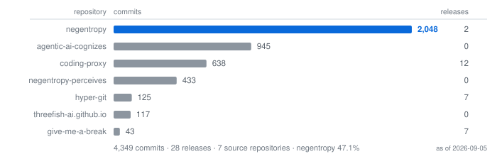

### Aurelius Huang · 阿浩

**Entropy reduction — of codebases, and of days.**

Agentic AI infrastructure at production scale, by day · [English](./README.md) · [简体中文](./docs/i18n/zh-CN/README.md) · [Notes](https://threefish-ai.github.io)

> 冬者岁之余，夜者日之余，阴雨者时之余。
>
> — Dong Yu (董遇), 3rd c.[^weilue] The surplus is already there; almost everyone lets it evaporate. [negentropy](https://github.com/ThreeFish-AI/negentropy) takes its name from Schrödinger's negative entropy.[^schrodinger]

---

Eleven years, square-root scale. **<!-- DATA:c2026 -->9,308<!-- /DATA:c2026 --> in <!-- DATA:cur_year -->2026<!-- /DATA:cur_year -->** — after two years that are genuinely zero and one year that is genuinely down.

The surplus, located: **<!-- DATA:peak_h -->22:00<!-- /DATA:peak_h -->**, <!-- DATA:peak_x -->2.54×<!-- /DATA:peak_x --> a flat baseline — <!-- DATA:commits_total -->4,349<!-- /DATA:commits_total --> open-source commits, Asia/Shanghai. Dawn is empty, not missing.

[negentropy](https://github.com/ThreeFish-AI/negentropy) knowledge engine · [coding-proxy](https://github.com/ThreeFish-AI/coding-proxy) failover for coding agents · [hyper-git](https://github.com/ThreeFish-AI/hyper-git) changelists for VS Code · [agents.md](https://github.com/ThreeFish-AI/agents.md) the doctrine they are written under

---

<!-- DATA:pub_prs -->1,849<!-- /DATA:pub_prs --> public pull requests ·
<!-- DATA:neg_pr -->1,078<!-- /DATA:neg_pr --> merged in negentropy, median <!-- DATA:neg_median -->6<!-- /DATA:neg_median --> min, <!-- DATA:pct_hour -->83%<!-- /DATA:pct_hour --> within an hour ·
<!-- DATA:streak -->88<!-- /DATA:streak -->-day streak ·
<!-- DATA:conv_pct -->77.1%<!-- /DATA:conv_pct --> Conventional Commits ·
<!-- DATA:rel_total -->28<!-- /DATA:rel_total --> releases ·
<!-- DATA:src_repos -->7<!-- /DATA:src_repos --> source repos,
<!-- DATA:own_stars -->51<!-- /DATA:own_stars --> stars actually mine ·
five of six upstream PRs merged ([Dify](https://github.com/langgenius/dify) ecosystem)

<b>Honesty notes</b>

- The headline count splits 5,590 public and clickable / 3,640 private work (as of 2026-09). Private work counts, but doesn't link — so it gets no headline.
- `negentropy` is a solo, self-merge repo: the PR is a titled, revertible unit of change, not a review gate. That is what the 6-minute median measures.
- [analysis_claude_code](https://github.com/ThreeFish-AI/analysis_claude_code) (<!-- DATA:acc_stars -->312<!-- /DATA:acc_stars --> stars) is mostly **not** my work — it mirrors [CrazyBoyM](https://github.com/CrazyBoyM) / ShareAI-Lab's Claude Code source analysis; the foundational commits are theirs. Mine in it: the reading notes.
- `negentropy-perceives` (433 commits) is archived — it graduated into the negentropy trunk. Intended lifecycle, not failure.
- The yearly figure uses a square-root scale so early years stay visible; it understates recent growth. All figures are regenerated monthly from the GitHub API by [one workflow](https://github.com/ThreeFish-AI/threefish-ai/blob/master/.github/workflows/refresh-profile-data.yml) — as of <!-- DATA:asof -->2026-09-05<!-- /DATA:asof -->.

---

[^weilue]: Yu Huan, *Weilüe* (魏略), “Biographies of Confucian Scholars”; survives via Pei Songzhi's annotation to Chen Shou, *Records of the Three Kingdoms* (三国志), *Biography of Wang Lang*, 3rd c. CE.

[^schrodinger]: E. Schrödinger, *What Is Life? The Physical Aspect of the Living Cell*. Cambridge, U.K.: Cambridge University Press, 1944.

[Notes](https://threefish-ai.github.io) · [CSDN](https://threefish.blog.csdn.net/) · [@ThreeFish-AI](https://github.com/ThreeFish-AI)

