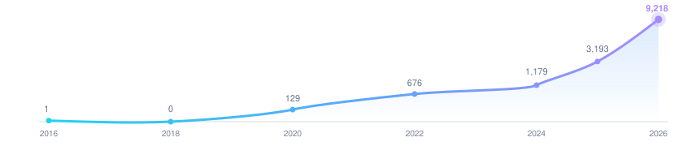

  

[English](../../../README.md) | [简体中文](./README.md)

<h1 align="center">你好，我是阿浩 (Aurelius Huang) 🐟</h1>

  <strong>在生产环境构建 Agentic AI 基础设施，并将「熵减」当作一种工程学科来实践——而不只是一个项目名字。</strong>

---

## 🐟 关于这个名字

**"ThreeFish" 是一个双关语。** 我的个人简介引用了三国时期学者董遇关于「三余」读书法的名言[[1]](#ref1)：

> 冬者岁之余，夜者日之余，阴雨者时之余。

他的意思是：不要坐等大段的空闲时间，而要主动夺回被大多数人白白浪费掉的「余」时间——冬天是一年的余暇，夜晚是一天的余暇，阴雨天是农时的余暇。「三余」与「三鱼」在普通话中读音相近，于是 **ThreeFish**（三鱼）便成了这句 1800 年前治学格言的一次俏皮音译，而非随手拍脑袋取的品牌名。

我把同样的直觉应用到工程实践的更高一层——「熵减」。信息系统若放任不管，会像无人认领的时间一样趋向噪声与遗忘。我的旗舰项目 [negentropy](https://github.com/ThreeFish-AI/negentropy) 的名字，正是直接借自薛定谔的「负熵」概念[[2]](#ref2)——生命通过持续输入秩序来对抗自身的熵增。夺回「余」时间，与从信息混沌中夺回秩序，对我而言是同一个动作在两个不同尺度上的投射。

白天，我在生产环境中构建需要扛住真实流量的 Agent 基础设施；而下方的开源产出，恰恰发生在董遇所说的那些「余」时间里——夜晚、周末、雨天。这个账号本身也在以同样的方式复利：2020 年回归时全年仅 129 次贡献 → 676（2022）→ 1,179（2024）→ 3,193（2025）→ 2026 年至今已达 9,218 次。熵减，先从自己的时间开始。

---

## ✨ 亮点数据

  
  
  
  

  

逐年贡献数 · 数值均为真实标注 · 纵轴经 √ 缩放以保留早期年份的可见度。

---

## 🛠️ 在做什么

<table>
<tr>
<td width="50%">
<a href="https://github.com/ThreeFish-AI/negentropy">
<picture>
  <source media="(prefers-color-scheme: dark)" srcset="https://github-stats-extended.vercel.app/api/pin/?username=ThreeFish-AI&repo=negentropy&bg_color=00000000&border_color=60A5FA&title_color=F1F5F9&text_color=CBD5E1&icon_color=60A5FA" />
  
</picture>
</a>
</td>
<td width="50%">
<a href="https://github.com/ThreeFish-AI/analysis_claude_code">
<picture>
  <source media="(prefers-color-scheme: dark)" srcset="https://github-stats-extended.vercel.app/api/pin/?username=ThreeFish-AI&repo=analysis_claude_code&bg_color=00000000&border_color=4ADE80&title_color=F1F5F9&text_color=CBD5E1&icon_color=4ADE80" />
  
</picture>
</a>
</td>
</tr>
<tr>
<td width="50%">
<a href="https://github.com/ThreeFish-AI/coding-proxy">
<picture>
  <source media="(prefers-color-scheme: dark)" srcset="https://github-stats-extended.vercel.app/api/pin/?username=ThreeFish-AI&repo=coding-proxy&bg_color=00000000&border_color=FB923C&title_color=F1F5F9&text_color=CBD5E1&icon_color=FB923C" />
  
</picture>
</a>
</td>
<td width="50%">
<a href="https://github.com/ThreeFish-AI/hyper-git">
<picture>
  <source media="(prefers-color-scheme: dark)" srcset="https://github-stats-extended.vercel.app/api/pin/?username=ThreeFish-AI&repo=hyper-git&bg_color=00000000&border_color=A78BFA&title_color=F1F5F9&text_color=CBD5E1&icon_color=A78BFA" />
  
</picture>
</a>
</td>
</tr>
</table>

同时在做：<a href="https://github.com/ThreeFish-AI/negentropy-perceives">negentropy-perceives</a>（AI Agent 感知引擎）· <a href="https://github.com/ThreeFish-AI/agents.md">agents.md</a>（跨项目 AI Agent 协作规约）

---

## 📊 GitHub 数据

<table>
<tr>
<td>
<picture>
  <source media="(prefers-color-scheme: dark)" srcset="https://github-stats-extended.vercel.app/api?username=ThreeFish-AI&show_icons=true&hide_border=true&hide_rank=true&bg_color=00000000&title_color=60A5FA&text_color=e6edf3&icon_color=60A5FA" />
  
</picture>
</td>
<td>
<picture>
  <source media="(prefers-color-scheme: dark)" srcset="https://github-stats-extended.vercel.app/api/top-langs/?username=ThreeFish-AI&layout=compact&hide_border=true&bg_color=00000000&title_color=60A5FA&text_color=e6edf3" />
  
</picture>
</td>
</tr>
</table>

---

## 🐍 贡献贪吃蛇

<picture>
  <source media="(prefers-color-scheme: dark)" srcset="https://raw.githubusercontent.com/ThreeFish-AI/threefish-ai/output/github-contribution-grid-snake-dark.svg" />
  <source media="(prefers-color-scheme: light)" srcset="https://raw.githubusercontent.com/ThreeFish-AI/threefish-ai/output/github-contribution-grid-snake.svg" />
  
</picture>

---

## 🔗 联系方式

<!-- 确认账号仍然有效后再启用：

-->

---

[1] 鱼豢，《魏略·儒宗传》；原书散佚，赖裴松之注《三国志·魏书·王朗传》（附王肃传）转引方得以流传，三国时期（3 世纪）。

[2] E. Schrödinger, "What is Life? The Physical Aspect of the Living Cell," _Cambridge University Press_, 1944.

---

  由 <a href="https://github.com/ThreeFish-AI">ThreeFish-AI</a> 用 🧠、❤️ 与不计其数的咖啡构建。

