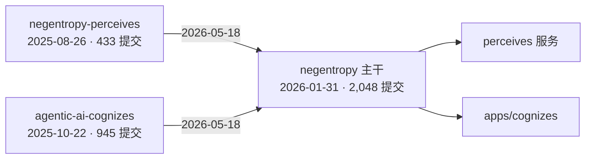
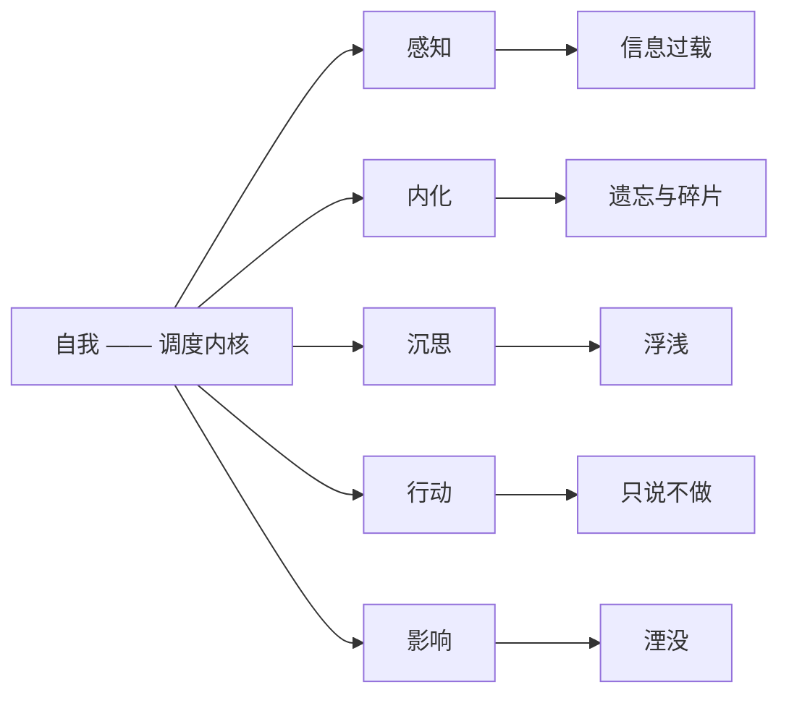
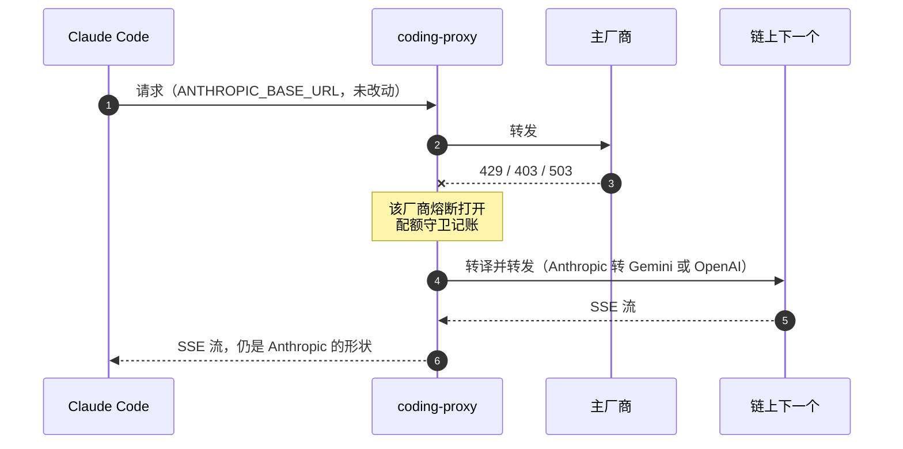

<!-- FIG:mark --><!-- /FIG:mark -->

### Aurelius Huang · 阿浩

**熵减——代码库的，与日子的。**

白天做生产级 Agent 基础设施 · [English](../../../README.md) · [简体中文](./README.md) · [笔记](https://threefish-ai.github.io)

**正在做** —— negentropy 朝一个没许诺过的 1.0 走 · hyper-git 的 M5，那五个目前返回空实现的 AI 接缝 · coding-proxy 三种请求形状之间的转译保真度 · 截至 <!-- DATA:asof -->2026-09-05<!-- /DATA:asof -->

> 冬者岁之余，夜者日之余，阴雨者时之余。
>
> ——董遇，三世纪。[^weilue] 冬是岁的余，夜是日的余，雨是时的余。他的答案不是「挤出时间」——而是：余暇本来就在那里，只是几乎所有人都任其蒸发。

> 秩序不是一个可以抵达的状态。它是活系统持续从环境中汲取的东西——负熵，不断输入，否则它就不再是活系统。[^schrodinger] 两个尺度，同一种失效模式：代码库漂向噪声，正如无人认领的时辰漂向浪费。[negentropy](https://github.com/ThreeFish-AI/negentropy) 之名取自后一句，而为前一句而建。

**如何读这一页。** 每个数字都以「登出访客能自行复现」的口径采集——公开贡献页、`is:public` 检索、公开 REST 端点。令牌只用于配额，从不用来放宽口径。凡是我能看见而你看不见的，都手写并标注日期。图表每月刷新；任何校验不通过，任务就什么都不写。

---

<!-- FIG:growth --><!-- /FIG:growth -->

十一年，平方根标度。**<!-- DATA:cur_total -->9,311<!-- /DATA:cur_total -->（<!-- DATA:cur_year -->2026<!-- /DATA:cur_year -->）**——此前是两个真正的零，和一次真正的回落。

**2016** —— 一条提交。**2017–2018** —— 空的；图上那个缺口是真的，而且长达两年。**2019** —— 13 条。**2020** —— 129 条，回来的那一年。**2022** —— 676 条。**2023** —— 589 条，低于上一年，图没有把它抹平。**2024** —— 1,181 条；当年 7 月，第一个上游补丁合入 [Dify](https://github.com/langgenius/dify/pull/5631)。**2025** —— 3,193 条；8 月有了 `negentropy-perceives`，10 月有了 `agentic-ai-cognizes`。**2026-01-31** —— 主干开始。**2026-05-18** —— 那两个仓库归档并入主干。**<!-- DATA:cur_year -->2026<!-- /DATA:cur_year -->** —— 目前 <!-- DATA:cur_total -->9,311<!-- /DATA:cur_total --> 条。

<!-- FIG:rhythm --><!-- /FIG:rhythm -->

余暇的落点：**<!-- DATA:peak_h -->22:00<!-- /DATA:peak_h -->**，平坦基线的 <!-- DATA:peak_x -->2.54×<!-- /DATA:peak_x -->——<!-- DATA:commits_total -->4,349<!-- /DATA:commits_total --> 条开源提交，Asia/Shanghai。黎明是空的，不是缺数据。

<!-- FIG:punchcard --><!-- /FIG:punchcard -->

二维答案：最密格 **<!-- DATA:pc_cell -->Sun 22:00<!-- /DATA:pc_cell -->**（周日 22:00），<!-- DATA:pc_val -->83<!-- /DATA:pc_val --> 条提交；168 格中 <!-- DATA:pc_empty -->37<!-- /DATA:pc_empty --> 格为真实零值；周末占 <!-- DATA:wknd_pct -->34.7%<!-- /DATA:wknd_pct -->（平坦份额 28.6%）。

<!-- FIG:surplus --><!-- /FIG:surplus -->

工作日对周末，按日均归一（**<!-- DATA:wd_days -->572<!-- /DATA:wd_days --> 个工作日 ÷ <!-- DATA:we_days -->230<!-- /DATA:we_days --> 个周末日**）：形状相同，且周末的日均反而更热——峰值落在 <!-- DATA:we_peak_h -->22:00<!-- /DATA:we_peak_h -->。「白天」是职业描述，不是作息表。

<!-- FIG:ground --><!-- /FIG:ground -->

[negentropy](https://github.com/ThreeFish-AI/negentropy) 知识引擎 · [coding-proxy](https://github.com/ThreeFish-AI/coding-proxy) 编码 Agent 故障转移 · [hyper-git](https://github.com/ThreeFish-AI/hyper-git) VS Code 变更列表 · [agents.md](https://github.com/ThreeFish-AI/agents.md) 它们共同遵循的规约

<!-- FIG:accrual --><!-- /FIG:accrual -->

月度累计：两条曲线在毕业并入主干的那一天走平，而主干继续爬升。窗口 <!-- DATA:win_from -->2024-06-22<!-- /DATA:win_from --> → <!-- DATA:win_to -->2026-09-01<!-- /DATA:win_to -->——**<!-- DATA:win_months -->26<!-- /DATA:win_months --> 个月，不是上方那张十一年图。**

<!-- FIG:lifecycles --><!-- /FIG:lifecycles -->

仓库即区间，自创建至最后推送；两根同日终止的条就是那次毕业。已删除的仓库在此口径下不可见。

<!-- FIG:cadence --><!-- /FIG:cadence -->

Release 有时机，不止有计数——最新一个：**<!-- DATA:rel_last_name -->give-me-a-break<!-- /DATA:rel_last_name --> <!-- DATA:rel_last_tag -->v0.1.6<!-- /DATA:rel_last_tag -->**。negentropy 以已合并 PR 交付，不以 tag。

<!-- FIG:streak --><!-- /FIG:streak -->

连续区间的落点：**<!-- DATA:streak -->88<!-- /DATA:streak --> 天，<!-- DATA:streak_from -->2026-03-19<!-- /DATA:streak_from --> → <!-- DATA:streak_to -->2026-06-14<!-- /DATA:streak_to -->**，已加括号标注。rug 图取最近 400 天；整个窗口 <!-- DATA:win_days -->802<!-- /DATA:win_days --> 天中 <!-- DATA:active_days -->249<!-- /DATA:active_days --> 天有提交（<!-- DATA:active_pct -->31%<!-- /DATA:active_pct -->）——口径为源仓库内我署名的提交，窄于上方的 GitHub 贡献日历。

---

<!-- FIG:latency --><!-- /FIG:latency -->

中位数藏掉的部分：p90 **<!-- DATA:p90 -->2.8 h<!-- /DATA:p90 -->**，最长 **<!-- DATA:lat_max -->11.9 d<!-- /DATA:lat_max -->**；已关闭 <!-- DATA:pr_closed -->1118<!-- /DATA:pr_closed --> 个中 <!-- DATA:pr_unmerged -->40<!-- /DATA:pr_unmerged --> 个未合并，未计入。单人自合并：量的是变更单元大小，不是评审速度。

<!-- FIG:grammar --><!-- /FIG:grammar -->

让「一百中之七十七」可数：**<!-- DATA:top_type -->fix<!-- /DATA:top_type --> <!-- DATA:top_type_pct -->19.0%<!-- /DATA:top_type_pct -->** 居首；**<!-- DATA:nonconf_n -->996<!-- /DATA:nonconf_n --> 条主题（<!-- DATA:nonconf_pct -->22.9%<!-- /DATA:nonconf_pct -->）不合规**——画作空心格，而不是藏起来。

<!-- FIG:tongues --><!-- /FIG:tongues -->

两种口径并陈，而非悄悄二选一：GitHub 端点说 **<!-- DATA:lang_naive -->HTML<!-- /DATA:lang_naive --> <!-- DATA:lang_naive_pct -->67.8%<!-- /DATA:lang_naive_pct -->**；剔除那个静态站构建产物仓库后，**<!-- DATA:lang_top -->Python<!-- /DATA:lang_top --> <!-- DATA:lang_top_pct -->69.1%<!-- /DATA:lang_top_pct -->**。字节数度量源码体积，不度量工作量或作者归属。

<!-- FIG:upstream --><!-- /FIG:upstream -->

N = <!-- DATA:ext_prs -->6<!-- /DATA:ext_prs -->，全部具名：<!-- DATA:ext_first -->2024-06-26<!-- /DATA:ext_first --> → <!-- DATA:ext_last -->2025-12-06<!-- /DATA:ext_last -->，<!-- DATA:ext_merged -->5<!-- /DATA:ext_merged --> 个已合并、一个关闭未合并——占全部公开 PR 的千分之几。比例本身就是重点。

---

### 针对五种崩坏方式而建

**[negentropy](https://github.com/ThreeFish-AI/negentropy)** —— 个人知识引擎：一个调度内核，五片羽翼，每片对准一种衰变。感知对抗信息过载，内化对抗遗忘与碎片，沉思对抗浮浅，行动对抗空谈，影响对抗湮没。记忆按艾宾浩斯曲线衰减——因为「什么都记住」本身就是另一种噪声。整套栈一条命令起五个容器，且不需要任何云凭据。
Python 3.13 · Next.js 16 · Google ADK · Apache-2.0 · <!-- DATA:neg_commits -->2,048<!-- /DATA:neg_commits --> 条提交 · <!-- DATA:neg_pr -->1,078<!-- /DATA:neg_pr --> 个已合并 PR · 两个 rc，尚无 1.0

**[coding-proxy](https://github.com/ThreeFish-AI/coding-proxy)** —— 编码 Agent 的 N 级链式故障转移。主厂商返回 `429`、`403`、`503` 时，请求顺链下降而不是直接失败：Claude 套餐、Copilot、Antigravity、GLM、MiniMax、Qwen、Kimi、豆包。每厂商独立熔断与配额守卫；Anthropic↔Gemini、Anthropic↔OpenAI 双向请求与 SSE 转译。客户端只改一行 `ANTHROPIC_BASE_URL`，此外什么都不必知道。
Python · FastAPI · httpx · SQLite-WAL 本地用量看板，无 Redis、无消息队列 · <!-- DATA:rel_cp -->12<!-- /DATA:rel_cp --> 个 release，最新版仍带 alpha 标

**[hyper-git](https://github.com/ThreeFish-AI/hyper-git)** —— 把 IntelliJ 的提交模型重建进 VS Code：多变更列表分组、手绘带泳道的提交图 DAG 与七个可组合筛选器、行级与 hunk 级提交、独立于 `git stash` 的 Shelf、手写三方合并编辑器。`engine/` 是零 `vscode` 依赖的纯逻辑层——403 个单元测试之所以能存在，只因为这一点。
TypeScript · 6 个视图 · 102 条命令 · 403 个单元测试 · <!-- DATA:rel_hg -->7<!-- /DATA:rel_hg --> 个 release · MIT · M0–M4 已交付，M5 尚未开工 · 已上架 [VS Code 市场](https://marketplace.visualstudio.com/items?itemName=ThreeFish-AI.hyper-git-agentic-git)

**[give-me-a-break](https://github.com/ThreeFish-AI/give-me-a-break)** —— 到点该停时遮蔽全部显示器的菜单栏应用。粉红噪声实时合成，不打包任何音频文件。Esc 可以逃，但要两次确认——没有逃生阀的强制休息，最后会被卸载。会议算工作，因此推迟休息，而不是吞掉休息。
Swift · macOS 14+ · 另有 C# Windows 构建 · <!-- DATA:rel_gmab -->7<!-- /DATA:rel_gmab --> 个 release · 未签名、未公证，并把 `xattr -dr` 那行命令明写在 README 里，而不是藏起来

**[agents.md](https://github.com/ThreeFish-AI/agents.md)** —— 上面四者共同遵循的规约，由 `./sync.sh --link` 软链进本机每一个 Agent。它不是宣言，是一个带主张的配置文件。

**用什么写** Python 3.13 · TypeScript · Swift · Shell，另有一个 C# 旁支构建。**跑在** FastAPI · httpx · Next.js 16 · Google ADK · PostgreSQL · SQLite-WAL · MCP · MicroSandbox。**靠什么保持诚实** structlog · OpenTelemetry · Langfuse。**怎么构建** `uv` · `pnpm` · 一条命令，五个容器。**没有** Redis，没有消息队列，默认路径上没有云凭据。

---

<b>体量</b> · <!-- DATA:commits_total -->4,349<!-- /DATA:commits_total --> 条提交，横跨 <!-- DATA:src_repos -->7<!-- /DATA:src_repos --> 个源仓库 · <!-- DATA:pub_prs -->1,849<!-- /DATA:pub_prs --> 个公开 PR · <!-- DATA:rel_total -->29<!-- /DATA:rel_total --> 个 release · <!-- DATA:own_stars -->51<!-- /DATA:own_stars --> 颗真正属于我的星 
<b>节律</b> · 峰值 <!-- DATA:peak_h -->22:00<!-- /DATA:peak_h -->，为平坦基线的 <!-- DATA:peak_x -->2.54×<!-- /DATA:peak_x --> · <!-- DATA:wknd_pct -->34.7%<!-- /DATA:wknd_pct --> 落在周末 · 最长 <!-- DATA:streak -->88<!-- /DATA:streak --> 天连续 · <!-- DATA:win_days -->802<!-- /DATA:win_days --> 天里 <!-- DATA:active_days -->249<!-- /DATA:active_days --> 天活跃 
<b>纪律</b> · <!-- DATA:conv_pct -->77.1%<!-- /DATA:conv_pct --> Conventional Commits · 开启到合并中位 <!-- DATA:neg_median -->6<!-- /DATA:neg_median --> 分钟、<!-- DATA:pct_hour -->83%<!-- /DATA:pct_hour --> 一小时内，自合并 · 上游 PR <!-- DATA:ext_merged -->5<!-- /DATA:ext_merged -->/<!-- DATA:ext_prs -->6<!-- /DATA:ext_prs --> 已合并

**上游，在不属于我的代码里** —— <!-- DATA:ext_merged -->5<!-- /DATA:ext_merged -->/<!-- DATA:ext_prs -->6<!-- /DATA:ext_prs --> 个 PR 已合并，其中 <!-- DATA:ext_dify -->4<!-- /DATA:ext_dify --> 个在 [Dify](https://github.com/langgenius/dify) 生态。

| 合并日 | 仓库 | 变更 |
|---|---|---|
| 2024-06-26 | langgenius/dify | [Notion 同步的文档截断与丢失](https://github.com/langgenius/dify/pull/5631) |
| 2024-09-30 | langgenius/dify | [Postgres 全文检索中的特殊字符兼容](https://github.com/langgenius/dify/pull/8921) |
| 2025-07-08 | langgenius/dify-cloud-kit | [GCS 二次保存时覆盖写入](https://github.com/langgenius/dify-cloud-kit/pull/3) |
| 2025-07-18 | langgenius/dify | [Notion 数据库按行序提取并附行页 URL](https://github.com/langgenius/dify/pull/22646) |
| 2025-12-06 | DayuanJiang/next-ai-draw-io | [补齐缺失的 OTLP trace exporter 依赖](https://github.com/DayuanJiang/next-ai-draw-io/pull/124) |
| *已关闭，未合并* | langgenius/dify-plugin-daemon | [OSS 中 `Save` 前先 `Exists` 检查](https://github.com/langgenius/dify-plugin-daemon/pull/389) |

六个对 <!-- DATA:pub_prs -->1,849<!-- /DATA:pub_prs --> 个公开 PR，这是诚实的比例：我绝大部分公开工作，都发生在我同时也是评审者的仓库里。

### 一个输入框，三篇文献

`give-me-a-break` 在每次自然休息之前弹出一个小框，问：你刚完成了什么；可选地，下一步是什么。它看起来像打卡机。它恰恰相反。

它存在的根本理由是 Leroy 关于「注意力残留」的研究：任务切换时，一部分注意力仍留在上一件事上，而当那件事被打断或未完成时，残留最重。[^leroy] 而休息，按定义就是一次打断。所以这个框不是用来度量刚过去的那一段——它是用来*关闭*那一段：花六十秒写下「已完成、尚未完成、回来后的第一步」，这既是一份可直接续上的计划，更重要的是，一份允许你停止再想它的许可。

Stubblebine 的间隙日志提供了触发时机与剂量：触发在任务切换处，而不是在钟点上；两到四句；六十到九十秒；并且必须保持轻——再重一点，第一周就会被放弃。[^interstitial] Fogg 提供了设计约束：提示弹出的那一刻，动机低且不稳定，于是唯一还能拉的杠杆是能力。[^fogg] 因此所有字段可选，回车即提交，超时自动放行，且不设最小字数——最小字数是被验证过的完成率杀手。

它只挂在唯一一个边界上：`working → resting`，并且永不阻塞休息本身。一个能阻止休息发生的休息仪式，不是休息仪式。

休息结束时对称地出现一个运动记录；两者都汇总进原生的周、月、季、年报表。至于这套东西在数月尺度上是否真的改变了行为，我没有测过——n=1，无基线；上面的文献讲的是注意力与习惯养成的一般机制，不是这个应用。这是一个讲得通的设计，不是一个被验证过的设计。

<b>诚实性说明</b>

- `negentropy` 是单人自合并仓库：PR 是有标题、可回滚的原子变更单元，不是评审门禁。<!-- DATA:neg_median -->6<!-- /DATA:neg_median --> 分钟中位时长测的就是这件事。
- [analysis_claude_code](https://github.com/ThreeFish-AI/analysis_claude_code)（<!-- DATA:acc_stars -->312<!-- /DATA:acc_stars --> 星）大部分**不是**我的作品——它镜像自 [CrazyBoyM](https://github.com/CrazyBoyM) / ShareAI-Lab 的 Claude Code 源码分析，奠基提交属原作者。属于我的部分：研读笔记。
- <!-- DATA:archived_names -->agentic-ai-cognizes, negentropy-perceives<!-- /DATA:archived_names -->（<!-- DATA:archived_n -->2<!-- /DATA:archived_n --> 个源仓库，合计 1,378 条提交）已归档——毕业并入 negentropy 主干：perceives 成为它的内容提取服务，cognizes 成为 `apps/cognizes`。这是预期的生命周期，不是失败。且天然冻结：归档不再变动。
- 标语下那行「正在做」是全页唯一自动化管不到的东西；手工维护，比其他一切腐化得都快。
- 年度图采用平方根标度以保留早期年份的可见度，因此低估了近年的增长。所有图表由[一个 workflow](https://github.com/ThreeFish-AI/threefish-ai/blob/master/.github/workflows/refresh-profile-data.yml) 每月自 GitHub API 重新生成——截至 <!-- DATA:asof -->2026-09-05<!-- /DATA:asof -->。

<b>两个仓库在同一天归档。这是有意的。</b>

`negentropy-perceives` 曾是独立的感知引擎——把网页与 PDF 变成供大模型使用的干净 Markdown。`agentic-ai-cognizes` 曾是面向中文读者的论文平台：关停时已收录 27 篇、翻译 16 篇、后端测试覆盖 82%、7 个 Claude Skill。两者都能跑。两者都在 **2026-05-18** 归档——距主干存在三个半月——因为两个共享记忆层却不共享进程的系统，等于两个需要你反复手工再集成的系统。

这就是预期的生命周期：一个仓库是一个假设，而好结果是它不再需要独立存在。

那两个归档里有 1,378 条提交。它们计入本页各项总数，但已不属于在跑的工作——若你只想据「活着的部分」评判，把它们减掉。

<b>negentropy —— 一根五翼</b>

每一片羽翼的存在理由，都写在它右边那一列。感知把网页与 PDF 变成干净的 Markdown；内化是知识图谱加语义检索，叠加艾宾浩斯衰减——于是回忆有成本，遗忘是设计出来的而非碰巧发生的；沉思是与一个论断争论的地方；行动是 MCP 与 MicroSandbox 双通道，让生成的代码跑在可以安全失败的地方；影响是负责发表的那部分。

后端可插拔——内存、PostgreSQL、VertexAI、GCS——默认路径完全不需要云凭据：`./dev` 拉起五个容器。可观测性由 structlog、OpenTelemetry 与 Langfuse 承担，这等于承认：五翼系统不是靠读代码就能调试的。

两个 rc，尚无 1.0。五翼并不同等完成——感知与内化承接了两个已归档仓库的全部历史，影响是最薄的一片。

<b>coding-proxy —— 一个 429 在客户端看起来是什么样</b>

客户端什么都不知道。这就是产品的全部：一行配置，把失败模式从「停止工作」改成「用别人的模型慢一点工作」。已接入九家——Claude 套餐、GitHub Copilot、Google Antigravity、Z AI 的 GLM、MiniMax、Qwen、小米、Kimi、豆包——每家独立熔断与配额守卫，另有本地 SQLite-WAL 看板，让消耗在账单之前就可见。

FastAPI 与 httpx；无 Redis，无消息队列。<!-- DATA:rel_cp -->12<!-- /DATA:rel_cp --> 个 release，最新仍带 alpha 标——三种请求形状之间的转译保真度，正是那个一直没做完的部分。链式转移也意味着请求可能在你没选的模型上成功；看板的存在，一部分就是为了让这件事可审计。

<b>同一个动作做了四遍：把内核做成纯函数</b>

- **`give-me-a-break`** —— 状态机的 `evaluate` 零时间依赖。时钟由参数传入，于是整套休息/工作/AFK 生命周期都能在虚拟时钟下测试：睡眠、崩溃后快进恢复、休息中途被拔掉的显示器。三个模块，其中一个对 macOS 一无所知。
- **`hyper-git`** —— `engine/` 里没有一处 `vscode` import。仅这一条约束，就是 403 个单元测试之所以存在的原因：变更列表分组、DAG 泳道布局、Conventional Commits 校验，全都不需要编辑器宿主即可测试。架构说明称之为「Path B」——消费稳定的 `vscode.git` API，其上一切手绘，而不去 fork。
- **`hyper-git`，再一次** —— 五个 AI 接缝（`ILlmProvider`、`ICommitMessageProvider`、`IPreCommitInspector`、`IChangelistGrouper`、`IConflictResolver`）以空实现预先接入，形制取自 JetBrains 的 `CheckinHandler` 生命周期。接口先交付，智能延到 M5。早声明接缝很便宜，晚声明就不便宜了。
- **`coding-proxy`** —— 故障转移链是策略，不是管道：熔断状态与配额记账按厂商分离、且是本地的，落在 SQLite-WAL 里。没有 Redis、没有队列，于是单进程就是整个部署，重启不会丢掉任何要紧的东西。
- **`negentropy`** —— 后端可在内存、PostgreSQL、VertexAI、GCS 之间替换，而默认路径**完全不需要云凭据**就能起。如果最便宜的配置跑不起来，也就没人会去跑贵的那个。

说得好听，这叫可测性。说得诚实，这是一个单人维护者为了在自己的代码库里活下来必须做的事：这里没有第二双眼睛，所以设计必须让错误便宜到能被找出来。而那五个空的 AI 接缝，至今仍然是空的——接口是一份计划，不是一个功能。

<b>这些仓库共同遵循的规约 —— 道 / 法 / 术</b>

[agents.md](https://github.com/ThreeFish-AI/agents.md) 刻意分三层：心法、策略、战术。`./sync.sh --link` 将它软链到 `~/.codex/AGENTS.md` 与 `~/.agents/docs/`，于是本机每一个 Agent 都加载同一份文件——改一行，各处工具的行为一起变。

| 层 | | 内容 |
|---|---|---|
| 道 | 心法 | 上下文驱动 · 最小干预 · 证据为准 · 系统完整性 · 知识晶化 · 主动导航 · 低熵表达 |
| 法 | 策略 | 默认先计划 · 子代理并发 · 完成前验证 · 复用驱动 · 边界管理 · 正交分解 · 单一事实源 · 分层表达 |
| 术 | 战术 | AI 结对流水线 · git/hooks/issue 纪律 · `uv` + `pnpm` 工具链 · 数据库安全护栏 · 文档与 Mermaid 规范 · UI 规范 |

需要精确的部分交由子规范承担：结构化表达框架（PREP、金字塔、SCQA、STAR）、含明确 OAuth 红线的浏览器验证协议，以及 IEEE 参考文献规范——这一页的脚注为何是这个样子，答案就在那里。

一颗星。它是我写过最不受欢迎、却杠杆最大的东西；这两件事并不矛盾。它也只是一份陈述意图的文档，不是强制执行的 linter——本页别处那个 <!-- DATA:conv_pct -->77.1%<!-- /DATA:conv_pct --> 的 Conventional Commits 比例，就是规约与实践之间被量出来的差距。

<b>这一页会招来的问题</b>

**「一年九千多次贡献——那是真活，还是脚本？」**
是真的，同时也确实被「小单位工作法」放大了。<!-- DATA:commits_total -->4,349<!-- /DATA:commits_total --> 条公开提交里 <!-- DATA:conv_pct -->77.1%<!-- /DATA:conv_pct --> 符合 Conventional Commits，类型大致是四分之一 `fix`、五分之一 `docs`、五分之一 `feat`——文档提交几乎与功能提交等量。请据 release（<!-- DATA:rel_total -->29<!-- /DATA:rel_total --> 个）与 diff 评判，而不是据计数。

**「一个人开发，为什么还要给自己开 PR？」**
因为 PR 是一个带标题、可回滚、附着 diff 的单元，无论有没有人评审，这件事本身有价值。它不是评审门禁，本页也从不这样称它。<!-- DATA:neg_median -->6<!-- /DATA:neg_median --> 分钟中位数测的是一个做完的分支等了多久，不是有人看了多久。

**「你星最多的仓库不是你的。」**
没错，而这是诚实性说明里的第一条。<!-- DATA:total_stars -->363<!-- /DATA:total_stars --> 颗星里有 <!-- DATA:acc_stars -->312<!-- /DATA:acc_stars --> 颗落在一个镜像他人 Claude Code 分析的仓库上。我更愿意被评判的那个数是 <!-- DATA:own_stars -->51<!-- /DATA:own_stars -->。

**「为什么全都要双语？」**
因为写作有一半是中文，读者有一半不是；而一个机翻的页面，会当场违反它自称遵循的「低熵表达」。两份 README 手工维护、结构互为镜像；里面的数字出自同一个生成器，因此不可能互相矛盾。

**「为什么发一个未签名的 macOS 应用？」**
因为公证需要一个开发者账号，而我没有为一个两颗星的菜单栏应用买它；不说出来的替代方案，是让 Gatekeeper 替我说。README 里印着那行 `xattr -dr`。如果这在你看来是一票否决——那它就该是。

<b>这一页省略了什么，以及为什么</b>

- **3,640 条私有贡献**（截至 2026-09），对应 5,590 条公开可点击的。它们是真实的工作，且不配上标题——因为一个你打不开的数，是一个你只能选择相信的数。这个拆分在这里由手写维护；生成器不被允许去看。
- **我的雇主，以及我拿薪水在建的生产系统。** 「白天做生产级 Agent 基础设施」已是这一页能给到的全部具体度。那部分工作，占私有数字里更大的一半。
- **粉丝数、访问计数、奖杯墙、连续打卡火焰、语言占比环。** 全都能用一行嵌入搞定；也全都在度量这个主页，而不是这些工作。本页那些图是为回答具体问题而写的，且每一张都印出生成它的那组数据。
- **任何我无法以「访客可复现」口径核实的东西。** 若某个论断需要比登出读者更宽的视野，它要么手写并标注日期，要么就不出现。
- **那些我有账号却没有产出的平台链接。** 在一个谈可核验的页面上，死链比没有链接更糟。

这些省略并不谦逊。它们只是我能辩护的那些。

<b>方法、口径，以及什么情况下这一页是错的</b>

**口径。** 所有自动刷新的数字都以匿名公开口径采集：登出访客看到的贡献页、GitHub 的 `is:public` 检索、公开 REST 端点。`GITHUB_TOKEN` 只为配额而存在。草稿 release 被排除——对匿名访客不可见、对有推送权限的 token 可见，计入就会让本地运行与 CI 运行不一致。受私有限制的数字（公开/私有拆分）由手写并标注截止日期，生成器从不改动。

**定义，让词只有一个意思。** *源仓库* 指非 fork 且有至少十条我署名提交的仓库——正因这个阈值，计数是 <!-- DATA:src_repos -->7<!-- /DATA:src_repos --> 个，而不是主页上的仓库总数。*真正属于我的星* 指总星数减去诚实性说明里那个镜像仓库。*连续天数* 指历史上最长的、每天都有公开署名提交的不间断区间——不是当前连续天数，且窄于 GitHub 贡献日历。*Conventional Commits* 是对首行做正则匹配，所以标题规范而正文说谎的提交同样计入。

**这一页是一个构建产物。** 一个 Python 脚本，仅用标准库，没有会腐烂的依赖。它从 GitHub 采集，渲染十四张 SVG，并从同一份「语言中立取值」的字典出发，重写两份 README——英文与中文——里的数字，因此同一个数不可能在这边说一套、那边说另一套。每张图在落盘之前都要过一道写入门禁：小于 8 KB；带 `role="img"` 且 alt 文本承载完整数据序列；无外部资源；没有任何会循环的动画——只有入场，默认态等于终态，整体置于 `prefers-reduced-motion: no-preference` 之后。

**守卫，每一条都会中止运行且一个字节不写。** 贡献页逐日 tooltip 之和必须等于该页自身的年度合计；小时、星期、逐日与提交类型直方图必须各自等于各仓库提交总数；当页面仍指向当年时，当年数字绝不允许下降；外部 PR 账本必须与它自己的 `total_count` 吻合；两份 README 必须携带完全相同的标记集合与顺序；替换必须是自身的不动点。陈旧而真，胜过新鲜而错。

**已知的失真。** 年度图采用平方根标度，以保住 2016 年那一条提交的可见度——代价是它*低估*而非美化近年的增长。低于 2.5 px 的柱按 2.5 px 绘制，所以最短的柱被略微夸大。零值画作基线下方的空槽，因为「没有柱子」和「柱子为零」是两个不同的事实。

自行复算提交类数字：<code>for r in $(gh api users/ThreeFish-AI/repos --paginate --jq '.[]|select(.fork==false)|.name'); do gh api "/repos/ThreeFish-AI/$r/commits?author=ThreeFish-AI" --paginate --jq '.[].commit.message|split("\n")[0]'; done</code>——注意它不含「十条提交」的源仓库阈值，原始运行会比本页多出几个仓库。由[一个 workflow](https://github.com/ThreeFish-AI/threefish-ai/blob/master/.github/workflows/refresh-profile-data.yml) 每月刷新 · 截至 <!-- DATA:asof -->2026-09-05<!-- /DATA:asof -->。以及诚实的边界：它只能自动化「公开可数」的部分——文字、论断，以及「正在做」那一行，都是手写的，可以无声地过期。没有脚本抓得住那个。

<b>全量仓库普查</b>

| 仓库 | 语言 | 提交 | Release | 星 | 状态 | 对准什么 |
|---|---|--:|--:|--:|---|---|
| [negentropy](https://github.com/ThreeFish-AI/negentropy) | Python · TS | 2,048 | 2 | 10 | 活跃，1.0 之前 | 信息衰变的五种形态 |
| [coding-proxy](https://github.com/ThreeFish-AI/coding-proxy) | Python | 638 | 12 | 19 | 活跃 | 把厂商故障当路由问题 |
| [hyper-git](https://github.com/ThreeFish-AI/hyper-git) | TypeScript | 125 | 7 | 10 | M0–M4 完成，M5 待开 | 提交的粒度 |
| [threefish-ai.github.io](https://threefish-ai.github.io) | — | 117 | — | — | 活跃 | 比标签页活得更久的笔记 |
| [give-me-a-break](https://github.com/ThreeFish-AI/give-me-a-break) | Swift · C# | 43 | 7 | 2 | 活跃，未签名 | 日子，而非代码库 |
| [agents.md](https://github.com/ThreeFish-AI/agents.md) | Shell | — | — | 1 | 活跃 | 另外六个怎么写出来 |
| [agentic-ai-cognizes](https://github.com/ThreeFish-AI/agentic-ai-cognizes) | Python | 945 | — | — | 2026-05-18 归档 | 并入 `apps/cognizes` |
| [negentropy-perceives](https://github.com/ThreeFish-AI/negentropy-perceives) | Python | 433 | 1 | — | 2026-05-18 归档 | 并入 perceives 服务 |
| [analysis_claude_code](https://github.com/ThreeFish-AI/analysis_claude_code) | — | — | — | 312 | 镜像 | **大部分不是我的作品**——见诚实性说明 |

<!-- DATA:src_repos -->7<!-- /DATA:src_repos --> 个源仓库 · <!-- DATA:commits_total -->4,349<!-- /DATA:commits_total --> 条我署名的提交 · <!-- DATA:rel_total -->29<!-- /DATA:rel_total --> 个 release · <!-- DATA:own_stars -->51<!-- /DATA:own_stars --> 颗真正属于我的星，主页显示的是 <!-- DATA:total_stars -->363<!-- /DATA:total_stars --> 颗。两行归档是毕业，不是伤亡。提交数以匿名口径统计我署名的部分；表体数字冻结于首次发布之时——若说明行与表体不一致，以说明行为准。

---

### 笔记 —— [threefish-ai.github.io](https://threefish-ai.github.io)

关于 AI Infra、Agent 工程与信息学的中文知识库。分两半：

- **知行** —— 数智通识 · 算法通解 · 计算通践 · 知见通感
- **智践** —— Agent 工程化 · AI Infra · AIGC

三条长线：**Negentropy** —— 熵减引擎的设计与用法，与代码并行写就 · **Harness Engineering** —— 把 Agent 工程当作一门学科来做的综述 · **Sinestesia of Cognition** —— 知见通感，最不实用，也最必需。

「你我的相识绝非一场零和游戏」——站点自己的那句话。全站中文写作，没有英文镜像；在英文页上假装有，是错的那种整齐。

---

[^weilue]: 鱼豢，《魏略·儒宗传》；原书已散佚，赖裴松之注《三国志·魏书·王朗传》转引流传，三国时期（3 世纪）。

[^schrodinger]: E. Schrödinger, *What Is Life? The Physical Aspect of the Living Cell*. Cambridge, U.K.: Cambridge University Press, 1944.

[^leroy]: S. Leroy, "Why is it so hard to do my work? The challenge of attention residue when switching between work tasks," *Organizational Behavior and Human Decision Processes*, vol. 109, no. 2, pp. 168–181, 2009.

[^interstitial]: T. Stubblebine, "Replace your to-do list with interstitial journaling to increase productivity," *Better Humans*, Sep. 2017. [Online]. Available: https://betterhumans.pub

[^fogg]: B. J. Fogg, "Fogg Behavior Model — Prompts," Stanford Behavior Design Lab. [Online]. Available: https://behaviordesign.stanford.edu/. [Accessed: Sep. 5, 2026].

「你我的相识绝非一场零和游戏」——也是这一页为什么要标出自己的误差棒。

[笔记](https://threefish-ai.github.io) · [CSDN](https://threefish.blog.csdn.net/) · [@ThreeFish-AI](https://github.com/ThreeFish-AI)

